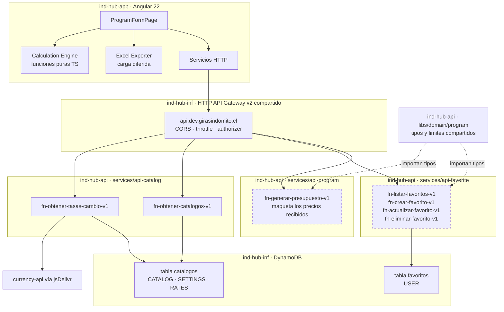
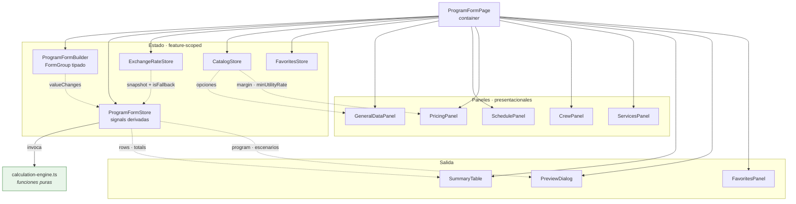
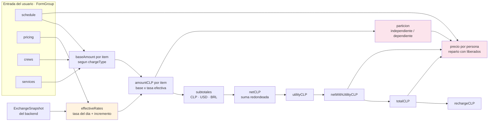
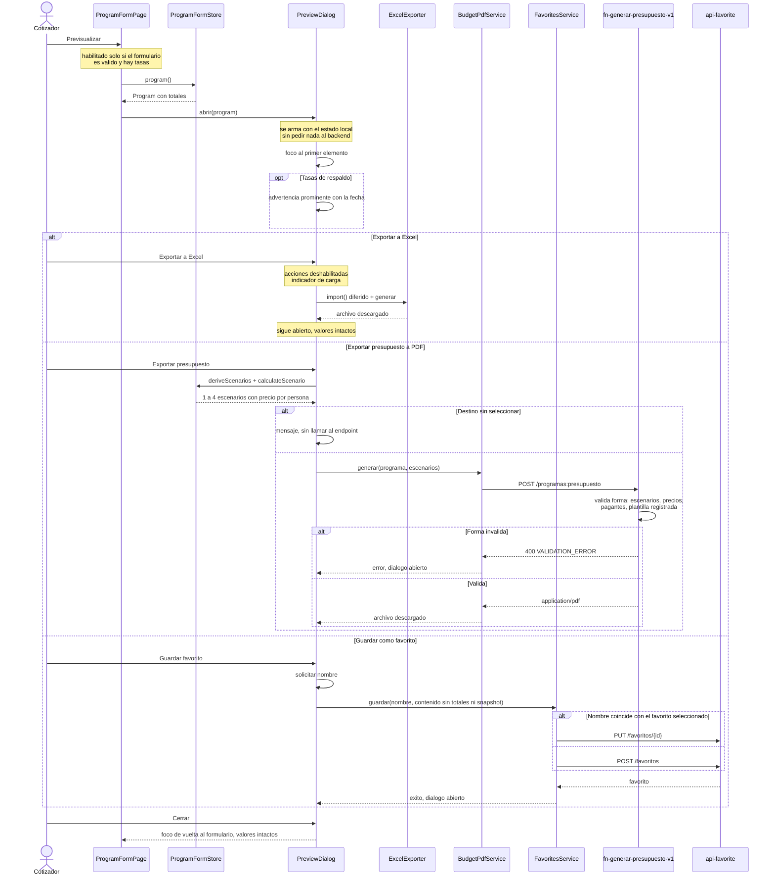

# Design Document

## Overview

El formulario de programa es una página del frontend con un motor de cálculo
reactivo, respaldada por tres microservicios Go independientes: `api-catalog`
(catálogos, parámetros de política y tipos de cambio), `api-favorite` (CRUD de
favoritos) y `api-program` (maquetación del PDF de presupuesto).

La feature tiene tres características que dominan el diseño:

1. **Es una calculadora de dinero.** El valor de la pantalla está en que los
   montos sean correctos y auditables, no en la interfaz. Por eso el cálculo se
   aísla en funciones puras y se verifica con property-based testing. Vive una
   sola vez, en TypeScript: no hay motor espejo en Go.
2. **No persiste el programa.** `POST /programas` está fuera del alcance, así que
   no hay escritura de programa, ni idempotencia, ni recálculo autoritativo en el
   backend. Los favoritos son el único mecanismo de persistencia, y el control
   sobre lo que sale de la aplicación es humano: la previsualización.
3. **Se construye sobre repositorios vacíos.** `ind-hub-app` tiene solo el
   scaffold de Angular (`app.ts`, `app.routes.ts`, `app.config.ts`, sin rutas) y
   `services/` del backend está vacío. No hay feature de referencia, ni
   interceptores, ni librerías compartidas en Go. Este diseño establece los
   patrones que heredarán las features siguientes, así que separa con claridad lo
   que es infraestructura reutilizable de lo que es propio del programa.

### Estado verificado de los repositorios

Lo que sigue se comprobó leyendo el código, no asumiendo:

| Hecho | Evidencia | Consecuencia para el diseño |
| --- | --- | --- |
| `ind-hub-app` tiene Angular 22.1, PrimeNG 22.1, TailwindCSS 4.3, Vitest 4, `@angular/forms`, `@angular/cdk` | `package.json` | Sin `@ngrx/signals` y sin librería de Excel. Ambas decisiones se resuelven en este diseño |
| `app.routes.ts` exporta un arreglo vacío | `src/app/app.routes.ts` | Hay que crear el enrutamiento, el layout y los interceptores desde cero |
| El presupuesto de bundle inicial es 500 kB de advertencia y 1 MB de error | `angular.json`, configuración `production` | Una dependencia de ~950 kB en el chunk inicial rompe el build. Determina la elección de la librería de Excel |
| `services/` está vacío y `go.work` solo declara `.` | `go.work`, `services/` | `api-catalog`, `api-favorite` y `api-program` son los primeros microservicios reales del proyecto |
| **`libs/` no existe**, pese a que `go-conventions.md` documenta `libs/shared/apperr`, `libs/lambdautil`, `libs/logger`, `libs/awsddb` | `go.mod`, listado del repo | Hay que crear esas librerías compartidas como parte de esta spec. Es trabajo de plataforma, no de la feature |
| El único módulo Go declara `aws-sdk-go-v2`, `config`, `credentials`, `sts` | `go.mod` | Faltan `aws-lambda-go`, `dynamodb`, `zap`, `echo`, `ulid` y la librería de PDF |
| `SHARED_AUTHORIZER_ENABLED = false` y el build **lanza excepción** si un endpoint no es `public` | `common/go-service.ts` | El bloqueo del Requirement 19 no es una convención: el build lo impone |
| Ya existe la tabla `programas` con `pk`/`sk`, `PAY_PER_REQUEST`, sin GSI ni TTL | `ind-hub-inf/ddb/ddb-config.ts` | **Esta spec no la usa.** Sin persistencia del programa no hay nada que escribir ahí; se crean dos tablas nuevas, `catalogos` y `favoritos` |
| Existen builders de políticas IAM para DynamoDB, ya con `index/*` | `aws/policies/dynamodb.ts` | Las políticas no hay que escribirlas. Lo que falta es que `go-service.ts` permita adjuntarlas |
| CORS del Gateway permite solo `localhost:4200` y el dominio de la SPA; throttle dev 10 rps | `ind-hub-inf/api-gateway/api-gateway-config.ts` | Mitigan volumen, no acceso. Sustenta el Requirement 19 |
| El handler legacy de tasas usa `@fawazahmed0/currency-api` vía jsDelivr, timeout 10 s, 3 reintentos con factor 2 | `portal-admin-sls.../get-currency-rates-v1.js` | La fuente externa y su política de reintentos se replican tal cual |
| El legacy calcula la porción de precio fijo **solo** con servicios `'Valor único'`; la tripulación se reparte entre pagantes | `program-calculations.service.ts`, `calculateUniqueCurrencyTotals` | Confirma la divergencia que declara el Requirement 8 |

### Resumen de decisiones

| # | Decisión | Elección | Sección |
| --- | --- | --- | --- |
| 1 | Estado del formulario | Typed Reactive Forms para la entrada, signals para lo derivado | [Manejo de estado](#manejo-de-estado-del-formulario) |
| 2 | Librería de Excel | `write-excel-file`, con carga diferida | [Exportación a Excel](#exportación-a-excel) |
| 3 | Rangos numéricos | Una sola tabla de límites en TypeScript, y su gemela en `libs/domain/program` | [Límites de campo](#límites-de-campo-compartidos) |
| 4 | Catálogos y política de empresa | Endpoint propio sobre DynamoDB, una sola consulta, con `CatalogSettings` | [Catálogos](#catálogos-y-parámetros-de-política) |
| 5 | Porción pasajero-independiente | Tripulación + `fixed` + `per_day` | [Motor de cálculo](#motor-de-cálculo) |
| 6 | Cantidad de motores de cálculo | Uno solo, en TypeScript. El backend maqueta lo que recibe y valida su forma | [PDF de presupuesto](#pdf-de-presupuesto) |
| 7 | PDF en Go | `signintech/gopdf` con plantillas declarativas propias | [PDF de presupuesto](#pdf-de-presupuesto) |
| 8 | Separación del backend | Tres módulos Go independientes, tipos compartidos por librería | [Estructura del backend](#estructura-del-backend) |
| 9 | Modelo DynamoDB | Dos tablas nuevas, `catalogos` y `favoritos`, una por servicio | [Modelo DynamoDB](#modelo-dynamodb) |
| 10 | Autenticación | Despliegue por fases; favoritos y presupuesto bloqueados | [Autorización](#autorización-y-superficie-expuesta) |
| 11 | Parámetros de margen | Precargados desde el catálogo, con piso de utilidad advertido y campos que siguen siendo obligatorios | [Precarga de parámetros](#precarga-de-parámetros-de-margen) |
| 12 | Indisponibilidad de la fuente de tasas | Snapshot de respaldo en la tabla `catalogos`, marcado con `isFallback` | [Tipos de cambio](#tipos-de-cambio-y-snapshot-de-respaldo) |
| 13 | Noches de estadía | Precargadas como `totalDays − 1`, con marca de intervención del usuario fuera del formulario | [Precarga de noches](#precarga-de-noches-de-estadía) |
| 14 | Escenarios del presupuesto | Derivados del programa por desplazamiento, acotados y deduplicados | [Escenarios del presupuesto](#escenarios-del-presupuesto) |

---

## Architecture

### Vista de sistema



Las cajas con borde discontinuo son las funciones cuyo despliegue queda bloqueado
por el Requirement 19. `api-program` no aparece conectado a ninguna tabla: no
tiene acceso a DynamoDB, porque no lo necesita.

### Autorización y superficie expuesta

Esta es la decisión con más consecuencias de seguridad del diseño, así que queda
explícita y no repartida en notas.

**Situación.** El Gateway compartido tiene `authorizerEnabled: false` y el builder
del backend tiene `SHARED_AUTHORIZER_ENABLED = false`. Con esa configuración,
`buildGoServiceServerless` **lanza una excepción en tiempo de build** si un
endpoint no declara `public: true`. No hay forma de desplegar un endpoint
protegido hoy.

**Riesgo de publicar los favoritos.** Si el CRUD de favoritos y el PDF se
declararan públicos para poder desplegarlos, cualquiera que conozca la URL podría
leer o borrar los favoritos de otro usuario simplemente cambiando el identificador
de usuario en la petición. Como los favoritos son el único mecanismo de
persistencia de la feature, eso equivale a publicar el trabajo guardado de todo el
equipo comercial. El allowlist de CORS no lo evita: CORS lo aplica el navegador, y
una petición desde `curl` lo ignora. El throttle de 10 peticiones por segundo en
dev limita el caudal, no el acceso.

**Diseño adoptado.** Se declara la intención real de cada endpoint y se separa la
implementación del despliegue:

| Endpoint | Servicio | `public` | Fase | Motivo |
| --- | --- | --- | --- | --- |
| `GET /tasas-cambio` | `api-catalog` | `true` | 1 | Reexpone un dato público de una API pública. No hay nada que proteger |
| `GET /catalogos` | `api-catalog` | `true` | 1 | Catálogo de planes y destinos, más los parámetros de margen de la empresa. Ver la nota de abajo |
| `GET·POST·PUT·DELETE /favoritos...` | `api-favorite` | `false` | 2 | El scope del favorito **es** la identidad del usuario. Sin authorizer, el aislamiento entre usuarios no existe |
| `POST /programas:presupuesto` | `api-program` | `false` | 2 | Genera un documento comercial e invoca compute facturable |

La separación en tres servicios simplifica el bloqueo: `api-catalog` es
desplegable hoy en su totalidad, y `api-favorite` y `api-program` quedan enteros
detrás de la bandera. No hace falta filtrar funciones dentro de un mismo
`serverless.ts`; basta con no desplegar dos de los tres servicios:

```ts
// services/api-favorite/serverless.ts y services/api-program/serverless.ts
// Todos los endpoints de estos dos servicios requieren identidad, así que
// mientras la bandera esté apagada el servicio completo no es desplegable.
if (!SHARED_AUTHORIZER_ENABLED) {
  throw new Error(
    'api-favorite requiere el authorizer compartido. Ver Requirement 19 de program-form.',
  );
}
```

Que el error sea explícito y mencione el requerimiento es deliberado: un
`make deploy service=services/api-favorite` ejecutado por descuido tiene que fallar
con una explicación, no con la excepción genérica del builder.

> **Los parámetros de margen viajan por un endpoint público.** `GET /catalogos`
> entrega `CatalogSettings`, que incluye la utilidad y el recargo por defecto de la
> empresa, su piso de política y el identificador del plan preseleccionado. Son
> valores por defecto de una plantilla de
> cotización, no márgenes de operaciones cerradas, y quien recibe una cotización ve
> el precio final de todas formas. Aun así conviene registrarlo: si más adelante
> esos parámetros se vuelven sensibles, `GET /catalogos` pasa a fase 2 y el
> Requirement 4.11 ya define el comportamiento del formulario cuando el catálogo no
> responde con parámetros.

**Consecuencia operativa.** Mientras dure la fase 1, el formulario se ejercita de
punta a punta contra los servidores locales (`make dev service=services/api-catalog`,
y lo mismo para los otros dos), que exponen sus rutas vía Echo. Los favoritos y el
PDF de presupuesto no funcionan contra `dev` ni contra `prd`. En `dev` el formulario
opera como calculadora, según el Requirement 19.6, y debe indicárselo al usuario
(19.7). Eso es intencional y debe quedar visible en `tasks.md` como bloqueo, no como
pendiente menor.

**Dependencia que hay que planificar aparte.** Desbloquear la fase 2 exige, en
orden: crear `services/api-auth` (el servicio de login, que no existe), desplegar
el authorizer, activar `authorizerEnabled` en infraestructura y activar
`SHARED_AUTHORIZER_ENABLED` en el backend. Está fuera del alcance de esta spec.

### Identidad del usuario

`api-favorite` lee el identificador del usuario del contexto que inyecta el
authorizer (`requestContext.authorizer.lambda`), nunca del cuerpo ni de una
cabecera (Requirement 19.8). Un `userId` que llegue en el cuerpo se ignora y se
registra como advertencia en el log.

Para que el código no tenga dos caminos, el servidor local inyecta un usuario fijo
de desarrollo en ese mismo lugar del contexto. El handler siempre lee del contexto;
lo que cambia es quién lo llena.

```go
// libs/lambdautil/identity.go
// UserIDFromContext extrae el identificador del usuario del contexto del
// authorizer. Devuelve error si el contexto no lo trae: un endpoint protegido
// que no puede identificar a quien llama no debe continuar.
func UserIDFromContext(req events.APIGatewayV2HTTPRequest) (string, error)
```

### Orden de despliegue

```text
1. ind-hub-inf   → make deploy resource=ddb stage=dev
                   (crea las tablas catalogos y favoritos)

2. ind-hub-api   → los tres servicios, en cualquier orden:
                   make deploy service=services/api-catalog  stage=dev   (fase 1)
                   make deploy service=services/api-favorite stage=dev   (fase 2, bloqueado)
                   make deploy service=services/api-program  stage=dev   (fase 2, bloqueado)

3. ind-hub-app   → npm run build:deploy:dev
```

El paso 1 va primero porque una tabla que no existe no admite ni una consulta:
`api-catalog` desplegado antes de su tabla falla en la primera invocación.

**El paso 2 no tiene orden interno.** Los tres servicios no dependen entre sí: no
comparten tabla, no se invocan mutuamente y sus únicas dependencias de código son
`libs/`, que es un módulo del mismo repositorio y se compila con cada uno. Esa
independencia es el beneficio operativo concreto de la separación del Requirement
17: desplegar un catálogo nuevo no toca los favoritos, y arreglar la maquetación
del PDF no toca ninguno de los dos.

El paso 3 va al final porque el frontend consume los tres, pero degrada con
elegancia si alguno falta: sin catálogos muestra el mensaje de reintento del
Requirement 2.8, y sin favoritos opera como calculadora (19.6).

---

## Components and Interfaces

### Estructura de archivos del frontend

```text
src/app/
├── app.config.ts                        — se extiende: HttpClient, interceptores, locale es-CL
├── app.routes.ts                        — se extiende: ruta /programas con carga diferida
│
├── core/                                — infraestructura transversal (nueva)
│   ├── http/
│   │   ├── error.interceptor.ts          — traduce `code` de error a mensaje de usuario
│   │   ├── correlation-id.interceptor.ts — inyecta X-Correlation-Id en cada petición
│   │   └── api-response.interface.ts     — envelope { data } y { code, message, details, traceId }
│   └── notifications/
│       └── notification.service.ts       — fachada sobre MessageService de PrimeNG
│
├── shared/
│   ├── validators/
│   │   ├── document-id.validator.ts      — RUT chileno, DNI argentino, CPF brasileño
│   │   ├── document-id.validator.spec.ts
│   │   ├── numeric-range.validator.ts    — validador construido desde FIELD_LIMITS
│   │   └── date-range.validator.ts
│   ├── formatting/
│   │   ├── clp.formatter.ts              — entero → cadena es-CL sin decimales
│   │   └── clp.formatter.spec.ts
│   └── components/
│       └── favorites-panel/              — reutilizable: el scope llega por input
│           ├── favorites-panel.component.ts
│           └── favorites-panel.component.html
│
└── features/programas/
    ├── programas.routes.ts
    │
    ├── calculation/                      — motor de cálculo. Sin dependencias de Angular
    │   ├── calculation-engine.ts          — API pública del motor
    │   ├── charge-type.ts                — base amount por tipo de cobro
    │   ├── per-passenger-split.ts        — reparto con pasajeros liberados
    │   ├── scenarios.ts                  — deriveScenarios: desplazamientos, acotado, dedupe
    │   ├── rounding.ts                   — round y ceil centralizados
    │   ├── calculation-engine.spec.ts    — ejemplos y casos límite
    │   ├── calculation-engine.property.spec.ts
    │   └── scenarios.property.spec.ts
    │
    ├── forms/
    │   ├── program-form.builder.ts       — construye el FormGroup tipado
    │   ├── nights-preload.ts             — precarga de noches y marca de intervención
    │   ├── margin-preload.ts             — precarga de los parámetros de margen
    │   └── program-form.types.ts         — tipos del formulario
    │
    ├── state/
    │   ├── program-form.store.ts          — puente form → signals + señales derivadas
    │   ├── exchange-rate.store.ts
    │   ├── catalog.store.ts
    │   └── favorites.store.ts
    │
    ├── services/                          — solo IO
    │   ├── exchange-rate.service.ts
    │   ├── catalog.service.ts
    │   ├── favorites.service.ts
    │   └── budget-pdf.service.ts
    │
    ├── exporters/
    │   ├── excel-exporter.ts             — import() diferido de write-excel-file
    │   ├── excel-layout.ts               — filas y estilos, sin la librería
    │   └── excel-layout.spec.ts
    │
    ├── pages/program-form/
    │   ├── program-form.page.ts           — container: orquesta, no calcula
    │   └── program-form.page.html
    │
    ├── components/                        — presentacionales, sin servicios inyectados
    │   ├── general-data-panel/
    │   ├── schedule-panel/
    │   ├── pricing-panel/
    │   ├── crew-panel/
    │   ├── services-panel/
    │   ├── summary-table/
    │   ├── fallback-rates-notice/         — advertencia de tasas de respaldo, reutilizada
    │   └── preview-dialog/
    │
    ├── interfaces/
    │   ├── program.interface.ts
    │   ├── catalog.interface.ts
    │   ├── exchange-rate.interface.ts
    │   └── favorite.interface.ts
    │
    └── constants/
        ├── field-limits.ts                — FIELD_LIMITS: única fuente de rangos
        ├── charge-types.ts                — catálogo con etiquetas en español
        └── scenario-defaults.ts           — DEFAULT_SCENARIO_OFFSETS y MAX_SCENARIOS
```

> **Divergencia con el estándar de nomenclatura.** `naming-conventions.md` indica
> interfaces con prefijo `I` (`ITrip`). El contrato aprobado en `requirements.md`
> usa `Program`, `CrewMember`, `ProgramService` sin prefijo. Este diseño sigue el
> contrato aprobado, porque el prefijo `I` es una convención que las guías de
> estilo de TypeScript y Angular desaconsejan desde hace años, y porque cambiarlo
> ahora obligaría a reescribir un contrato ya revisado. **La consecuencia es que
> el estándar queda desactualizado respecto del primer feature real del
> frontend**; corregirlo es un cambio en el orquestador que esta spec no ejecuta.

### Diagrama de componentes



Los paneles reciben su `FormGroup` por input y no inyectan servicios, según el
estándar de arquitectura. El motor no conoce Angular: recibe datos y devuelve
datos, lo que lo hace testeable sin `TestBed`.

### Manejo de estado del formulario

**Decisión: Typed Reactive Forms para la entrada y la validación, signals para
todo lo derivado.**

El repositorio no tiene `@ngrx/signals` y no se agrega. Las tres alternativas
evaluadas:

| Opción | Por qué no |
| --- | --- |
| Signals puros | Obliga a reimplementar validadores por fila, estados `touched`/`dirty`, y la integración con los componentes de PrimeNG que esperan `ControlValueAccessor`. Es rehacer `FormArray` con menos funcionalidad |
| Agregar `@ngrx/signals` | Es lo que usa el legacy, pero resuelve el estado asíncrono, no los formularios. El legacy igual usa `FormArray` debajo. Sería una dependencia nueva para un problema que ya está resuelto |
| Signal Forms de Angular | La API todavía no es estable en 22.x. No es el lugar para estrenarla en la primera feature real que además maneja dinero |

**La mejora concreta sobre el legacy** está en qué vive dentro del formulario. En
el legacy, el `FormGroup` incluye controles para `neto`, `utilities`,
`netoWithUtilities`, `totalWithRecharge`, `subTotal`, `iva` y `total` por fila: son
resultados de cálculo almacenados como si fueran entrada del usuario, mantenidos
al día con `patchValue` desde efectos. Ese patrón es el origen de la mayoría de
los bucles de recálculo y de los valores residuales al resetear.

Acá la regla es estricta:

> **El formulario contiene únicamente lo que el usuario escribe. Todo valor
> derivado es un `computed()` y no existe como control.**

Eso deja fuera del formulario a `totalDays`, `payingPassengers`, `baseAmount`,
`amountCLP`, las tasas efectivas y los nueve campos de `ProgramTotals`. Se calculan
al leerse y se serializan solo al momento de armar el cuerpo de la petición.

#### El puente entre el formulario y los signals

```ts
// state/program-form.store.ts (extracto ilustrativo)
@Injectable()
export class ProgramFormStore {
  private readonly form = inject(ProgramFormBuilder).form;
  private readonly rates = inject(ExchangeRateStore);

  /**
   * Se suscribe por sección y no al formulario completo. Escribir en el nombre
   * de un servicio invalida `services` pero no `schedule` ni `pricing`, así que
   * las señales derivadas de esas secciones no se recalculan.
   */
  private readonly schedule = this.sectionSignal('schedule');
  private readonly pricing = this.sectionSignal('pricing');
  private readonly crews = this.sectionSignal('crews');
  private readonly services = this.sectionSignal('services');

  readonly effectiveRates = computed(() =>
    buildEffectiveRates(this.pricing(), this.rates.snapshot()),
  );

  readonly derived = computed(() =>
    calculateProgram({
      schedule: this.schedule(),
      pricing: this.pricing(),
      crews: this.crews(),
      services: this.services(),
      rates: this.effectiveRates(),
    }),
  );

  readonly rows = computed(() => this.derived().rows);
  readonly totals = computed(() => this.derived().totals);

  /** Filtro de la tabla. Deliberadamente no participa de `totals`. */
  readonly searchTerm = signal('');
  readonly visibleRows = computed(() => filterRows(this.rows(), this.searchTerm()));

  private sectionSignal<K extends keyof ProgramFormValue>(key: K) {
    const control = this.form.controls[key];
    return toSignal(
      control.valueChanges.pipe(map(() => control.getRawValue())),
      { initialValue: control.getRawValue() },
    );
  }
}
```

Dos detalles que importan:

- Se usa `getRawValue()` y no el valor que emite `valueChanges`, porque
  `valueChanges` omite los controles deshabilitados y el formulario deshabilita
  selectores mientras cargan los catálogos.
- `searchTerm` es un signal aparte y `totals` no lo lee. Esa separación es la que
  implementa el Requirement 9.10: el pie es estructuralmente incapaz de depender
  del filtro, no es una condición que haya que recordar respetar.

### Precarga del plan por defecto

`CatalogSettings.defaultPlanId` mantiene la selección inicial como configuración
dinámica de la tabla, no como una constante del frontend. Cuando llega el catálogo,
el formulario busca ese identificador únicamente entre los planes vigentes y
preselecciona la opción completa con `emitEvent: false`, conservando el control
`pristine`. Si el campo está ausente o no coincide, el selector queda vacío,
obligatorio e inválido; nunca se elige silenciosamente el primer elemento.

### Precarga de parámetros de margen

El Requirement 4.10 pide precargar incremento USD, incremento BRL, utilidad y
recargo con los valores que entrega el catálogo. El 4.11 pide que, si el catálogo
no los entrega, los campos queden sin selección **y sigan siendo obligatorios**.

**El detalle que los requerimientos no fijan** es cómo conviven las dos cosas. Un
campo precargado y a la vez obligatorio abre una pregunta concreta: ¿el formulario
queda válido de entrada, sin que el usuario haya mirado el panel de precios?

La resolución adoptada: **precargar es escribir un valor, no relajar una
validación.** Los cuatro controles se construyen siempre con `Validators.required`
y ese validador no se toca nunca. Lo que cambia según el catálogo es únicamente el
valor inicial:

| Respuesta del catálogo | Valor del control | `required` | Estado del control | Formulario |
| --- | --- | --- | --- | --- |
| Trae `margin` | El del catálogo | Sí | `valid`, `pristine` | Válido en cuanto al margen |
| Omite `margin` | `null` | Sí | `invalid`, `pristine` | Bloquea previsualizar |

```ts
// forms/margin-preload.ts
/**
 * Aplica los valores por defecto de margen al formulario. No modifica
 * validadores: los cuatro controles nacen con `required` y lo conservan.
 * `emitEvent: false` evita un recálculo redundante, porque el store ya va a
 * leer el estado cuando llegue el snapshot de tasas.
 */
export function applyMarginDefaults(
  pricing: FormGroup<PricingControls>,
  margin: MarginDefaults | undefined,
): void {
  if (!margin) return;                       // Requirement 4.11: sin selección
  if (pricing.dirty) return;                 // el usuario ya decidió: no se sobrescribe
  pricing.patchValue(
    {
      usdIncreaseCLP: margin.usdIncreaseCLP,
      brlIncreaseCLP: margin.brlIncreaseCLP,
      utilityRate: margin.utilityRate,
      rechargeRate: margin.rechargeRate,
    },
    { emitEvent: false },
  );
}
```

> **Por qué el formulario sí queda válido sin que el usuario mire el panel.** Es la
> consecuencia buscada, no un efecto colateral. La justificación del Requirement 4
> es que el modo de falla peligroso no es "el cotizador no revisó el margen", es
> "el cotizador dejó la utilidad en 0 sin darse cuenta". Precargar convierte el
> caso normal en el caso por defecto, y el piso de utilidad hace visible la
> desviación cuando alguien baja el margen a propósito. Un `required` que exige
> reconfirmar a mano un valor que la empresa ya definió solo entrena al usuario a
> pasar por el panel sin leerlo. La guarda `pristine` es lo que preserva la
> decisión del usuario si el catálogo responde tarde.

La advertencia de piso de utilidad (4.12) es un `computed()` que compara el
control con `minUtilityRate` del catálogo, y no bloquea nada:

```ts
readonly belowUtilityFloor = computed(() => {
  const floor = this.catalog.settings()?.margin.minUtilityRate;
  const selected = this.pricing().utilityRate;
  return floor != null && selected != null && selected < floor;
});
```

Se renderiza en el panel de precios como mensaje de advertencia dentro de la región
`aria-live="polite"` que exige el Requirement 15.9. Nunca deshabilita previsualizar,
exportar ni guardar favorito (4.13).

### Precarga de noches de estadía

Los Requirements 3.11 y 3.12 describen un comportamiento con memoria: las noches se
precargan como `max(1, totalDays − 1)` mientras el usuario no las haya tocado, y
dejan de precargarse en cuanto las modifica.

**El problema de diseño** es dónde vive "el usuario ya las tocó". No puede ser un
control más del formulario: sería un valor que el usuario nunca escribe, viajaría en
`getRawValue()` hacia el motor de cálculo y hacia el contenido del favorito, y
contradice la regla de esta sección de que el formulario contiene únicamente lo que
el usuario escribe.

Tampoco sirve `control.dirty` a secas. `patchValue` con `emitEvent: false` no marca
`dirty`, así que la primera precarga no lo activa —correcto—, pero `dirty` también
se activa por un `markAsDirty()` de cualquier otro flujo, y sobre todo se borra con
`form.reset()` y al cargar un favorito, que son justamente los momentos en que la
distinción importa.

**Mecanismo adoptado: un signal de la clase, alimentado por el evento de edición
del control.**

```ts
// forms/nights-preload.ts

/**
 * Estado de la precarga de noches. Vive como signal del store y no como control
 * del formulario, porque no es un dato del programa: es una preferencia de la
 * sesión de edición.
 */
export type NightsSource = 'preloaded' | 'user';
```

```ts
// state/program-form.store.ts (extracto)

/** Arranca en 'preloaded'. Un favorito cargado trae noches decididas por alguien. */
private readonly nightsSource = signal<NightsSource>('preloaded');

constructor() {
  const nights = this.form.controls.schedule.controls.totalNights;

  // `events` distingue el origen del cambio. Solo una interacción real del
  // usuario emite un ValueChangeEvent sobre un control marcado como touched.
  nights.events
    .pipe(
      filter((event) => event instanceof ValueChangeEvent),
      takeUntilDestroyed(),
    )
    .subscribe(() => {
      if (this.applyingPreload) return;      // el propio patchValue no cuenta
      this.nightsSource.set('user');         // Requirement 3.12
    });

  // Requirement 3.11: solo mientras la fuente siga siendo la precarga.
  effect(() => {
    const days = this.totalDays();
    if (this.nightsSource() !== 'preloaded') return;
    this.applyingPreload = true;
    nights.setValue(Math.max(1, days - 1), { emitEvent: false });
    this.applyingPreload = false;
  });
}

/** Cargar un favorito trae noches que alguien decidió: no se vuelven a precargar. */
loadFavorite(content: FavoriteContent): void {
  this.form.reset();
  this.nightsSource.set('user');
  this.form.patchValue(toFormValue(content));
}
```

Tres decisiones de este mecanismo:

- **`applyingPreload` como guarda de reentrada.** Sin ella, el `setValue` de la
  precarga se leería como intervención del usuario y la precarga se apagaría sola
  en el primer cambio de fechas. Es un flag local de una interacción acotada, no
  estado compartido.
- **Un favorito cargado marca `'user'`.** El favorito persiste `totalNights`
  (Requirement 11.16), así que ese valor es una decisión tomada. Volver a
  precargarlo al recalcular las fechas la descartaría en silencio, que es
  exactamente lo que el criterio 3.12 evita.
- **`form.reset()` de un formulario nuevo vuelve a `'preloaded'`.** Empezar de cero
  es empezar sin decisiones.

La advertencia de incoherencia entre noches y días (3.13) es otro `computed()` que
compara ambas cantidades, se muestra en la región `aria-live` y no bloquea ninguna
acción (3.14). El caso legítimo que protege es la gira con bus nocturno, donde las
noches igualan a los días.

### Motor de cálculo

Vive en `calculation/` como funciones puras exportadas, sin clases ni receptores,
por la misma razón que el estándar de Go lo pide allá: no hay estado que agrupar.

```ts
/** Entrada completa del cálculo. Todo lo que el motor necesita, nada más. */
export interface CalculationInput {
  schedule: ScheduleInput;   // totalDays, totalNights, totalPassengers, freePassengers
  pricing: PricingInput;     // utilityRate, rechargeRate
  rates: EffectiveRates;     // { CLP: 1, USD: number, BRL: number }
  crews: CrewInput[];
  services: ServiceInput[];
}

/** Resultado completo. Incluye las filas para no recorrer dos veces las listas. */
export interface CalculationResult {
  rows: SummaryRow[];
  totals: ProgramTotals;
}

export function calculateProgram(input: CalculationInput): CalculationResult;
export function baseAmount(item: ChargeableItem, schedule: ScheduleInput): number;
export function buildEffectiveRates(pricing: PricingInput, snapshot: ExchangeSnapshot): EffectiveRates;
export function perPassengerPrice(amount: number, context: SplitContext): number;
export function calculateScenario(input: CalculationInput, scenario: ScenarioShape): CalculationResult;
export function deriveScenarios(schedule: ScheduleInput, offsets: number[]): ScenarioShape[];
```

#### Flujo del cálculo reactivo



Las cajas rosadas son la parte que corrige al legacy.

#### Monto base por tipo de cobro

| `chargeType` | Fórmula | Depende de pasajeros |
| --- | --- | --- |
| `fixed` | `unitPrice` | No |
| `per_day` | `unitPrice × totalDays` | No |
| `per_passenger` | `unitPrice × totalPassengers` | Sí |
| `per_passenger_night` | `unitPrice × totalPassengers × totalNights` | Sí |
| `per_passenger_day` | `unitPrice × totalPassengers × totalDays` | Sí |
| Tripulante | `dailyPrice × totalDays` | No |

El multiplicador es `totalPassengers`, con los liberados incluidos: un pasajero
liberado igual duerme en el hotel y entra al parque. Lo que no hace es pagar, y de
eso se ocupa el reparto.

#### Conversión y neto

```text
amountCLP(item)  = baseAmount(item) × effectiveRate(item.currency)
effectiveRate    = tasaDelDía + incremento     (CLP → 1, sin incremento)
netRaw           = Σ amountCLP(item)            sin redondear
netCLP           = round(netRaw)
```

`netRaw` se conserva sin redondear porque es el denominador de la partición y la
base de la utilidad. Redondear antes propaga el error a la baja en programas con
muchos ítems.

#### Utilidad, recargo y total

```text
utilityCLP        = ceil(netRaw × utilityRate / 100)
netWithUtilityCLP = netCLP + utilityCLP
totalCLP          = round(netWithUtilityCLP × (1 + rechargeRate / 100))
rechargeCLP       = totalCLP − netWithUtilityCLP
```

Tres decisiones heredadas del legacy que se mantienen a propósito, porque cambiarlas
alteraría los montos de cotizaciones históricas:

- La utilidad se calcula sobre `netRaw` y se suma a `netCLP`. Mezcla la base sin
  redondear con la redondeada, lo que es discutible, pero la diferencia es de un
  peso y replicarlo garantiza que un programa recotizado dé el mismo número.
- El recargo es compuesto: se aplica sobre neto más utilidad.
- `rechargeCLP` se obtiene por diferencia y no multiplicando. Eso hace que la
  descomposición cierre exacta por construcción, sin residuo de redondeo.

#### Reparto por persona: la corrección al legacy

El problema: un servicio de precio fijo, como el arriendo del bus, cuesta lo mismo
con 30 pasajeros que con 33. Si su costo se reparte solo entre los pagantes, los
pagantes subsidian a los liberados en un ítem cuyo costo los liberados no
provocaron. La solución del legacy es dividir esa porción entre **todos** los
pasajeros y el resto entre los pagantes.

```text
independentCLP = Σ amountCLP(item)  donde item es tripulante, `fixed` o `per_day`

si freePassengers == 0  o  netRaw == 0:
    perPassenger(amount) = ceil(amount / payingPassengers)

en otro caso:
    independentShare = amount × (independentCLP / netRaw)
    dependentShare   = amount − independentShare
    perPassenger(amount) = ceil( independentShare / totalPassengers
                               + dependentShare  / payingPassengers )
```

**La divergencia.** El legacy construye `independentCLP` filtrando
`item.type === 'Valor único'`. La tripulación queda fuera, y como el tipo de la
fila de un tripulante es `'Tripulación'`, su costo cae íntegro en la porción
dependiente y se reparte solo entre pagantes. Pero el costo de un guía es
`dailyPrice × totalDays`: no cambia con la cantidad de pasajeros. Es exactamente
la misma naturaleza que un servicio de precio fijo. Lo mismo pasa con `per_day`,
un tipo de cobro que el legacy no tiene.

Este diseño incluye tripulación, `fixed` y `per_day` en la porción independiente.

**Efecto en el precio.** El reparto de la porción independiente entre 30 en vez de
28 la abarata, así que el precio por persona **baja** respecto del legacy. En un
programa donde la tripulación pesa 15% del neto, con 30 pasajeros y 2 liberados, la
diferencia es del orden de 1% del precio final. Es una rebaja, no un alza, y el
solicitante validó explícitamente este cambio el 14 de septiembre de 2026.

#### Escenarios del presupuesto

Un escenario es el mismo motor con otro `totalPassengers` y otro `freePassengers`.
`calculateScenario` reconstruye la entrada con esas cantidades y llama a
`calculateProgram`, sin lógica duplicada. Los ítems `fixed` y `per_day` no cambian;
los `per_passenger*` se recalculan solos porque la fórmula ya depende del
parámetro (Requirement 13.8).

Lo que sí es lógica nueva es **de dónde salen esas cantidades**. El Requirement 13
las deriva del propio programa en cinco pasos, y el orden entre ellos importa:

```ts
// constants/scenario-defaults.ts

/** Requirement 13.3: respaldo cuando el catálogo no declara desplazamientos. */
export const DEFAULT_SCENARIO_OFFSETS = [-10, -5, 0, 5] as const;

/** Requirement 13.11: el endpoint acepta entre 1 y 4 escenarios. */
export const MAX_SCENARIOS = 4;
```

```ts
// calculation/scenarios.ts
import { DEFAULT_SCENARIO_OFFSETS, MAX_SCENARIOS } from '../constants/scenario-defaults';
import type { ScenarioShape } from '../interfaces/program.interface';

/**
 * Deriva las cantidades de cada escenario a partir de las del programa.
 *
 * Orden de las operaciones, que no es intercambiable:
 *   1. desplazar   — pasajeros del programa + offset            (13.2)
 *   2. acotar      — mínimo 1 pasajero                          (13.4)
 *   3. proporción  — liberados según la razón del programa      (13.5)
 *   4. acotar      — máximo totalPassengers − 1 liberados       (13.6)
 *   5. deduplicar  — descartar pares (total, libres) repetidos  (13.7)
 */
export function deriveScenarios(
  schedule: ScheduleInput,
  offsets: readonly number[] = DEFAULT_SCENARIO_OFFSETS,
): ScenarioShape[] {
  const freeRatio =
    schedule.totalPassengers > 0
      ? schedule.freePassengers / schedule.totalPassengers
      : 0;

  const seen = new Set<string>();
  const scenarios: ScenarioShape[] = [];

  for (const offset of offsets) {
    const totalPassengers = Math.max(1, schedule.totalPassengers + offset);
    const freePassengers = Math.min(
      Math.max(0, Math.round(totalPassengers * freeRatio)),
      totalPassengers - 1,
    );

    const key = `${totalPassengers}:${freePassengers}`;
    if (seen.has(key)) continue;
    seen.add(key);

    scenarios.push({
      totalPassengers,
      freePassengers,
      payingPassengers: totalPassengers - freePassengers,
    });

    if (scenarios.length === MAX_SCENARIOS) break;
  }

  return scenarios;
}
```

**Por qué el orden es ese, y qué pasa si se invierte.**

| Paso | Si se hiciera antes de lo que corresponde |
| --- | --- |
| Acotar el total antes de la proporción | Es lo correcto: la proporción tiene que aplicarse sobre el total ya acotado, o un programa de 8 pasajeros con offset −10 calcularía liberados sobre −2 |
| Deduplicar antes de acotar | Los offsets `−10` y `−5` sobre un programa de 3 pasajeros producen `−7` y `−2`, distintos entre sí, y ambos se acotan a 1. Deduplicar antes los dejaría pasar y el PDF mostraría dos columnas idénticas de 1 pasajero |
| Acotar liberados antes de la proporción | No tiene sentido: no hay valor que acotar todavía |

Ese segundo caso es el que justifica que el criterio 13.7 exista como criterio
aparte: **el acotamiento es lo que crea los duplicados**, así que la deduplicación
tiene que ocurrir después. Con los desplazamientos por defecto y un programa
pequeño, la lista de cuatro escenarios se reduce sola:

| Programa | Offsets | Totales tras acotar | Escenarios finales |
| --- | --- | --- | --- |
| 30 pasajeros, 2 libres | −10, −5, 0, +5 | 20, 25, 30, 35 | 4 escenarios, sin duplicados |
| 8 pasajeros, 1 libre | −10, −5, 0, +5 | 1, 3, 8, 13 | 4 escenarios |
| 3 pasajeros, 0 libres | −10, −5, 0, +5 | 1, 1, 3, 8 | 3 escenarios: se descarta el segundo `1:0` |
| 1 pasajero, 0 libres | −10, −5, 0, +5 | 1, 1, 1, 6 | 2 escenarios: `1:0` y `6:0` |

El último caso es el que garantiza el mínimo del Requirement 13.11: el escenario de
offset 0 siempre sobrevive —es el programa mismo—, así que `deriveScenarios` nunca
devuelve una lista vacía y el frontend nunca envía 0 escenarios. El tope de 4 lo
impone `MAX_SCENARIOS` sobre la cantidad de desplazamientos configurados, de modo
que un catálogo cargado con seis offsets recorta en vez de hacer fallar la
generación.

`freeRatio` se calcula una sola vez sobre el programa y se reutiliza en todos los
escenarios. Redondear la proporción en cada escenario en vez de arrastrar decimales
es lo que hace que las cantidades sean enteros presentables: un escenario con 2,4
liberados no es algo que se pueda poner en un presupuesto.

### Límites de campo compartidos

Un solo objeto es la fuente de los rangos, y de él se derivan los validadores del
formulario, los atributos de los controles de PrimeNG y los mensajes de error:

```ts
// constants/field-limits.ts
export const FIELD_LIMITS = {
  totalDays:        { min: 1,    max: 100,      step: 1 },
  totalNights:      { min: 1,    max: 100,      step: 1 },
  totalPassengers:  { min: 1,    max: 100,      step: 1 },
  freePassengers:   { min: 0,    max: 99,       step: 1 },
  usdIncreaseCLP:   { min: 0,    max: 200,      step: 5 },
  brlIncreaseCLP:   { min: 0,    max: 40,       step: 5 },
  utilityRate:      { min: 0,    max: 100,      step: 1 },
  rechargeRate:     { min: 0,    max: 100,      step: 1 },
  itemPrice:        { min: 0.01, max: 99_999_999 },
  maxCrews:         20,
  maxServices:      100,
  nameMinLength:    3,
} as const;
```

Su gemelo en Go vive en `libs/domain/program/limits.go` y declara los mismos
valores. Sin persistencia del programa, el backend ya no revalida el contrato
completo: los límites que Go aplica son los del cuerpo del `Budget_Pdf_Endpoint`
—cantidad de escenarios, pasajeros por escenario, precios positivos— y no los de
cada fila de servicio o tripulante. La coincidencia entre las dos tablas se
mantiene por revisión, y el alcance real de esa duplicación es acotado justamente
porque el backend valida forma y no cálculo.

### Exportación a Excel

**Decisión: `write-excel-file`, con carga diferida.**

| Candidato | Evaluación |
| --- | --- |
| `exceljs` | Es lo que usa el legacy y cumple funcionalmente. Pesa del orden de cientos de kB y arrastra polyfills de `stream` y `buffer` en un build de navegador. Contra un presupuesto de 500 kB de advertencia y 1 MB de error, el riesgo de romper el build es concreto. Su última publicación en npm es de 2023 |
| `xlsx` (SheetJS) | La edición comunitaria migró fuera del registro npm y el estilado de celdas pertenece a la edición de pago. Fricción de licencia y de distribución |
| Implementación propia | Un `.xlsx` es un ZIP con XML de OOXML. Escribirlo con estilos, formatos numéricos y ancho de columnas significa implementar parte de la especificación más un escritor de ZIP. Es un proyecto, no una tarea |
| **`write-excel-file`** | Diseñado para el navegador, sin polyfills de Node, mantenido de forma activa (commits en 2026). Cubre lo que exige el Requirement 12: filas de encabezado, negrita, colores, formato numérico y ancho de columnas |

La carga diferida satisface el Requirement 12.8 y es lo que mantiene el peso fuera
del chunk inicial:

```ts
// exporters/excel-exporter.ts
export async function exportProgramToExcel(layout: ExcelLayout): Promise<void> {
  const { default: writeXlsxFile } = await import('write-excel-file/browser');
  const workbook = writeXlsxFile(layout.rows, {
    columns: layout.columns,
    sheet: layout.sheetName,
  });
  await workbook.toFile(layout.fileName);
}
```

La entrada `/browser` y el método `toFile` corresponden a la API publicada por
`write-excel-file` 4.x; ambos siguen dentro del `import()` para conservar la carga
diferida.

`excel-layout.ts` construye las filas, los estilos y el nombre del archivo **sin
importar la librería**. Eso permite testear el contenido y el formato del nombre en
Vitest sin cargar la dependencia ni tocar el sistema de archivos, que es donde
está el riesgo real de defecto.

La versión se fija exacta en `package.json`, sin rango, según la regla de
dependencias del proyecto.

### Flujo de previsualización y salida

Sin persistencia del programa, la previsualización dejó de ser la antesala de una
escritura. Ahora es el punto de bifurcación entre las tres acciones del Requirement
10.7, y el diálogo no se cierra solo: cada acción termina y el detalle sigue en
pantalla, porque el cotizador puede querer exportar el Excel y además guardar el
favorito.



Tres puntos del flujo que responden a requerimientos concretos:

- **El diálogo se arma desde el estado local** (Requirement 10.4). No hay endpoint
  de previsualización, y con el motor de cálculo viviendo solo en el frontend
  tampoco hay nada que el backend pudiera agregar al detalle.
- **Ninguna acción cierra el diálogo.** El Requirement 10.8 reserva el cierre para
  la acción "Cerrar" explícita, y el 10.10 obliga a mantenerlo abierto con los
  valores intactos cuando una acción falla. El flujo no destruye nada: no hay
  reinicio del formulario, porque no hay creación que dé por terminado el trabajo.
- **La previsualización es el control humano del riesgo del Requirement 18.** Los
  precios del PDF los calcula el navegador y el backend no los recalcula. Lo que
  hay entre un defecto de cálculo y un colegio recibiendo un presupuesto equivocado
  es esta pantalla, y por eso muestra el detalle completo y no un resumen.

### Estructura del backend

El Requirement 17 pide tres módulos Go independientes, cada uno con su propio
despliegue, sin dependencias de código entre ellos. Los tipos que dos de ellos
necesitan compartir viven en una librería.

#### Librerías compartidas

```text
ind-hub-api-gox-sls-pri-gh/
├── go.work    — se agrega ./libs, ./services/api-catalog,
│                ./services/api-favorite y ./services/api-program
│
└── libs/                                  — NUEVO. Documentado en go-conventions
    ├── go.mod
    ├── logger/logger.go                   — zap estructurado
    ├── shared/apperr/apperr.go            — errores de dominio → HTTP + code
    ├── shared/resp/resp.go                — envelope de exito y de error
    ├── lambdautil/
    │   ├── bind.go                        — BindJSON
    │   ├── validate.go                    — ValidateStruct
    │   ├── response.go                    — SuccessResponse / ErrorResponse
    │   ├── identity.go                    — UserIDFromContext
    │   └── echo-adapter.go                — puente Echo ↔ APIGatewayV2 para local
    ├── awsddb/client.go                   — cliente DynamoDB. Sin Scan expuesto
    │
    └── domain/program/                    — tipos de dominio del programa
        ├── program.go                     — ProgramGeneral, CrewMember, ProgramService
        ├── catalog.go                     — CatalogRef, CatalogSettings, MarginDefaults
        ├── exchange.go                    — ExchangeSnapshot
        ├── charge_type.go                 — ChargeType, CurrencyCode
        ├── scenario.go                    — BudgetScenario
        └── limits.go                      — limites numericos compartidos
```

> **Por qué los tipos de dominio se comparten por librería y no por servicio.**
> `api-favorite` guarda contenido de programa, así que necesita las mismas
> estructuras que describe el contrato de datos: `ProgramGeneral`, `CrewMember`,
> `ProgramService`. `api-program` necesita `CatalogRef` y `BudgetScenario` para
> maquetar. Si `api-favorite` importara esos tipos desde `api-program`, un cambio en
> el servicio del presupuesto obligaría a recompilar y desplegar el de favoritos, y
> el Requirement 17.5 lo prohíbe explícitamente. Con los tipos en
> `libs/domain/program`, los tres servicios dependen de la librería y ninguno del
> otro: `api-catalog` la usa para `CatalogRef` y `CatalogSettings`, y no sabe que los
> otros dos existen.

#### `services/api-catalog` — catálogos y tasas de cambio

```text
services/api-catalog/
├── go.mod
├── serverless.ts                          — ambos endpoints public: true
├── service.config.json
├── openapi.fragment.json
│
├── cmd/
│   ├── local-api/main.go
│   ├── fn-obtener-catalogos-v1/main.go
│   └── fn-obtener-tasas-cambio-v1/main.go
│
├── functions/
│   ├── app.go                             — bootstrap del servicio
│   ├── config.go                          — nombre de la tabla catalogos
│   ├── routes.go
│   ├── obtener-catalogos-v1/
│   │   ├── endpoint.go
│   │   ├── fn-query-catalog.go            — Query unico sobre pk = CATALOG
│   │   └── fn-query-catalog_test.go
│   └── obtener-tasas-cambio-v1/
│       ├── endpoint.go
│       ├── fn-fetch-rates.go              — fuente externa, 3 reintentos
│       ├── fn-rate-snapshot.go            — lee y escribe el snapshot de respaldo
│       ├── fn-fetch-rates_test.go
│       └── fn-rate-snapshot_test.go
│
└── domain/
    ├── catalog_item.go                    — representacion DynamoDB del catalogo
    ├── rate_item.go                       — representacion DynamoDB del snapshot
    └── keys.go                            — construccion de pk/sk de catalogos
```

#### `services/api-favorite` — CRUD de favoritos

```text
services/api-favorite/
├── go.mod
├── serverless.ts                          — los cuatro endpoints requieren identidad
├── service.config.json
├── openapi.fragment.json
│
├── cmd/
│   ├── local-api/main.go
│   ├── fn-listar-favoritos-v1/main.go
│   ├── fn-crear-favorito-v1/main.go
│   ├── fn-actualizar-favorito-v1/main.go
│   └── fn-eliminar-favorito-v1/main.go
│
├── functions/
│   ├── app.go
│   ├── config.go                          — nombre de la tabla favoritos
│   ├── routes.go
│   ├── listar-favoritos-v1/
│   │   ├── endpoint.go
│   │   └── endpoint_test.go
│   ├── crear-favorito-v1/
│   │   ├── endpoint.go
│   │   └── endpoint_test.go
│   ├── actualizar-favorito-v1/
│   │   └── endpoint.go
│   └── eliminar-favorito-v1/
│       └── endpoint.go
│
└── domain/
    ├── favorite.go                        — Favorite y FavoriteContent
    └── keys.go                            — construccion de pk/sk de favoritos
```

`domain/favorite.go` compone los tipos de `libs/domain/program`: define
`FavoriteContent` con los campos que el Requirement 11.16 exige persistir, y omite
por tipo los totales y el snapshot que el 11.17 prohíbe guardar.

#### `services/api-program` — PDF de presupuesto

```text
services/api-program/
├── go.mod
├── serverless.ts                          — un endpoint, requiere identidad
├── service.config.json
├── openapi.fragment.json
│
├── cmd/
│   ├── local-api/main.go
│   └── fn-generar-presupuesto-v1/main.go
│
├── functions/
│   ├── app.go
│   ├── config.go                          — sin nombre de tabla: no accede a DynamoDB
│   ├── routes.go
│   └── generar-presupuesto-v1/
│       ├── endpoint.go
│       ├── fn-validate-request.go         — validacion de forma del cuerpo
│       ├── fn-validate-request_test.go
│       ├── fn-compose-pdf.go              — compositor de bloques sobre gopdf
│       ├── fn-compose-pdf_test.go
│       └── templates/
│           ├── registry.go                — budgetTemplateId → plantilla
│           └── brochure-brf.go
│
└── domain/
    └── budget_request.go                  — cuerpo de POST /programas:presupuesto
```

`config.go` de `api-program` no declara nombre de tabla y su rol IAM no lleva
política de DynamoDB. Eso implementa los Requirements 17.9 y 17.12 por
construcción: no es que el servicio decida no consultar la base, es que no puede.

`libs/` es trabajo de plataforma que esta feature paga por ser la primera. Se
implementa con lo mínimo que estos siete endpoints necesitan; no se especula con
funcionalidad para features futuras.

### Endpoints

| Nombre | Método y path | Servicio | Función | Fase |
| --- | --- | --- | --- | --- |
| Obtener tasas de cambio | `GET /tasas-cambio` | `api-catalog` | `fn-obtener-tasas-cambio-v1` | 1 |
| Obtener catálogos | `GET /catalogos` | `api-catalog` | `fn-obtener-catalogos-v1` | 1 |
| Listar favoritos | `GET /favoritos?scope=programa` | `api-favorite` | `fn-listar-favoritos-v1` | 2 |
| Crear favorito | `POST /favoritos` | `api-favorite` | `fn-crear-favorito-v1` | 2 |
| Actualizar favorito | `PUT /favoritos/{id-favorito}` | `api-favorite` | `fn-actualizar-favorito-v1` | 2 |
| Eliminar favorito | `DELETE /favoritos/{id-favorito}` | `api-favorite` | `fn-eliminar-favorito-v1` | 2 |
| Generar presupuesto | `POST /programas:presupuesto` | `api-program` | `fn-generar-presupuesto-v1` | 2 |

Siete endpoints repartidos en tres servicios. Los paths conviven en el mismo API
Gateway compartido sin colisionar, porque cada servicio registra únicamente los
suyos; el Gateway no sabe ni le importa que vengan de stacks distintos.

Paths en español, plural, kebab-case, sin tildes, y `:accion` para la operación no
CRUD, según `api-design.md`. El path de `serverless.ts` y el que se registra en
`endpoint.go` para el servidor local deben coincidir; el README del backend advierte
que es fácil desincronizarlos, así que ambos se derivan de una constante única por
endpoint.

Ajustes de memoria y timeout por función, apoyados en el paradigma
endpoint-per-function:

| Función | Memoria | Timeout | Razón |
| --- | --- | --- | --- |
| `fn-obtener-tasas-cambio-v1` | 128 MB | 30 s | Dos llamadas externas con 3 reintentos y 10 s de límite cada una, más la escritura del snapshot de respaldo. El timeout debe cubrir el peor caso sin cortar antes que la política de reintentos |
| `fn-obtener-catalogos-v1` | 128 MB | 6 s | Una sola consulta |
| `fn-generar-presupuesto-v1` | 512 MB | 20 s | Hasta cuatro escenarios y composición del PDF en memoria. No calcula precios: los recibe |
| Favoritos | 128 MB | 6 s | Lectura y escritura simples |

### Tipos de cambio y snapshot de respaldo

Replica el comportamiento del handler legacy, que está verificado en producción:
fuente `@fawazahmed0/currency-api` vía la CDN de jsDelivr, dos peticiones en
paralelo, límite de 10 segundos por petición, hasta 3 reintentos con espera
creciente de factor 2, y redondeo al entero más cercano.

```go
// Constantes del endpoint. El límite de 10 s es el mismo del handler legacy
// y el que declara el Requirement 14.7.
const (
    ratesBaseURL   = "https://cdn.jsdelivr.net/npm/@fawazahmed0/currency-api@latest/v1/currencies"
    ratesTimeout   = 10 * time.Second
    ratesMaxRetry  = 3
    ratesBackoff   = 500 * time.Millisecond
)
```

Si las dos fechas informadas difieren, se usa la del USD y se registra advertencia,
según el Requirement 14.12.

#### El snapshot de respaldo

El Requirement 14 agrega un comportamiento que el legacy no tiene: cuando la fuente
externa no responde, el endpoint entrega el último snapshot que sí obtuvo, marcado
como respaldo.

```text
GET /tasas-cambio
  │
  ├─ consulta la fuente externa (USD y BRL en paralelo, 10 s, hasta 3 intentos)
  │
  ├─ exito ──► escribe el snapshot en la tabla catalogos   (14.4)
  │            responde con isFallback = false             (14.5)
  │
  └─ los 3 intentos fallan
       │
       ├─ existe snapshot ──► responde con su fecha original
       │                      e isFallback = true          (14.8)
       │                      log warn con la fecha        (14.10)
       │
       └─ no existe ────────► 502 UPSTREAM_SERVICE_ERROR   (14.9)
```

El ítem del snapshot vive en la tabla `catalogos`, en su propia clave de partición:

| Atributo | Valor |
| --- | --- |
| `pk` | `RATES` |
| `sk` | `LATEST` |
| `date` | fecha informada por la fuente, ISO 8601 |
| `usdToClp`, `brlToClp` | enteros ya redondeados |
| `fetchedAt` | instante de la consulta exitosa que lo escribió |

Es un único ítem que se sobrescribe con `PutItem` en cada consulta exitosa. No hay
historial: lo que se necesita es "la última tasa buena que vimos", y guardar la
serie completa agregaría almacenamiento y una decisión de retención para un dato que
nadie va a consultar hacia atrás. `date` viene de la fuente y `fetchedAt` del reloj
del servidor; los dos, porque responden preguntas distintas —de cuándo es la tasa y
cuándo la conseguimos— y en un respaldo entregado tres días después no coinciden.

La escritura del snapshot ocurre **después** de haber armado la respuesta, y su
fallo no hace fallar la petición: si `PutItem` falla, se registra en `warn` y se
responde igual con las tasas frescas que ya se obtuvieron. Degradar la disponibilidad
de un dato correcto porque no se pudo guardar el respaldo sería exactamente el
comportamiento que este mecanismo viene a evitar.

Esta es la única razón por la que `api-catalog` necesita `dynamodbCrudPolicy` y no
`dynamodbReadPolicy`: los catálogos y los parámetros los lee, el snapshot lo
escribe.

> **Respaldo por disponibilidad, no cacheo por rendimiento. No es lo mismo, y la
> diferencia no es semántica.** El cacheo de tasas se descartó y sigue descartado: el
> Alcance de `requirements.md` lo deja fuera de forma explícita. Tres diferencias
> concretas con lo que se descartó:
>
> 1. **Cuándo se lee.** Un caché se lee *primero*, para ahorrar la llamada externa.
>    El snapshot se lee *último*, solo después de que tres intentos fallaron. La
>    fuente externa se consulta en cada apertura del formulario, igual que antes: no
>    se ahorra ni una llamada.
> 2. **Qué problema resuelve.** Un caché resuelve latencia y costo. El snapshot
>    resuelve que una caída de jsDelivr hoy deja el formulario inutilizable, porque
>    sin tasas no hay conversión, ni previsualización, ni exportación.
> 3. **Si el cliente lo sabe.** Un caché es transparente por diseño: el cliente no
>    distingue un valor cacheado de uno fresco, y ahí está el riesgo de cotizar con
>    una tasa vieja sin saberlo. El snapshot llega con `isFallback: true` y su fecha
>    original, y los Requirements 1.7, 9.12 y 10.6 obligan a mostrarlo en las tres
>    pantallas donde se mira el precio.
>
> Un caché hace que la tasa vieja pase desapercibida. El respaldo hace lo contrario:
> la declara.

#### Propagación de `isFallback` al frontend

La marca viaja dentro del `ExchangeSnapshot`, así que llega al `ExchangeRateStore` sin
tratamiento especial y de ahí a las tres pantallas que deben advertirlo:

| Pantalla | Qué muestra | Requerimiento |
| --- | --- | --- |
| Zona de divisas del formulario | Aviso prominente con la fecha del snapshot y acción de reintentar | 1.7, 1.9 |
| Pie de la `Summary_Table` | Aviso junto a los valores de USD y BRL usados en el cálculo | 9.12 |
| `Preview_Dialog` | Aviso sobre el detalle, antes de exportar o guardar | 10.6 |

Las tres usan el mismo componente presentacional,
`components/fallback-rates-notice/`, que recibe la fecha por input y no inyecta
nada. Un solo lugar donde está redactado el mensaje, y tres lugares donde se
renderiza:

```ts
// state/exchange-rate.store.ts (extracto)
readonly snapshot = signal<ExchangeSnapshot | null>(null);

/** Verdadero cuando se está cotizando con tasas de una fecha anterior. */
readonly usingFallback = computed(() => this.snapshot()?.isFallback === true);

/** Fecha que la advertencia debe mostrar. Null cuando no hay respaldo. */
readonly fallbackDate = computed(() =>
  this.usingFallback() ? (this.snapshot()?.date ?? null) : null,
);
```

Lo que **no** hace `isFallback` es deshabilitar nada. Los Requirements 1.8 y 4.13
mantienen habilitadas previsualizar, exportar y guardar favorito: un respaldo es una
tasa real de una fecha anterior, y bloquear el formulario convertiría una caída de
jsDelivr en una jornada sin cotizar.

### Catálogos y parámetros de política

Un solo `Query` sobre `pk = "CATALOG"` devuelve los tres catálogos ordenados, lo que
cumple el Requirement 16.2 sin ningún `Scan`. El orden de presentación va embebido
en la clave de ordenamiento, así que DynamoDB entrega los ítems ya ordenados y el
handler no ordena nada.

La respuesta lleva `Cache-Control: max-age=300` (Requirement 16.10). Son datos que
cambian con frecuencia de meses; cinco minutos de caché en el navegador elimina la
petición en cada navegación al formulario sin comprometer la frescura.

Cada destino declara `budgetTemplateId`. El acoplamiento con el generador de PDF es
real: un destino cargado con un identificador de plantilla que nadie implementó
produciría un error interno. El Requirement 18.8 lo convierte en un
`VALIDATION_ERROR` con mensaje claro, validando el identificador contra el registro
de plantillas antes de intentar generar.

#### `CatalogSettings`: la política de empresa viaja con el catálogo

Los Requirements 16.6, 16.7 y 16.11 agregan a la respuesta el plan inicial, los
parámetros de margen y los desplazamientos de escenario. Van en el mismo `Query`,
en un ítem aparte:

| Atributo | Valor |
| --- | --- |
| `pk` | `CATALOG` |
| `sk` | `SETTINGS` |
| `defaultPlanId` | identificador del plan vigente que se preselecciona |
| `margin` | mapa con `usdIncreaseCLP`, `brlIncreaseCLP`, `utilityRate`, `rechargeRate`, `minUtilityRate` |
| `scenarioOffsets` | lista de enteros |

Que el ítem comparta la partición `CATALOG` con las opciones de plan, temporada y
destino es lo que permite servir todo con **una sola consulta**. El handler separa
los ítems por su `sk`: los que empiezan con un scope conocido van a las listas, y
`SETTINGS` va a `settings`. Si el ítem no existe, el campo se omite de la respuesta
(Requirements 16.8 y 16.9) y el frontend aplica sus respaldos: campos de margen sin
selección y aún obligatorios (4.11), y desplazamientos `[-10, -5, 0, +5]` (13.3).

```go
// Omitir en vez de enviar ceros. Un utilityRate en 0 es un valor legítimo que
// significa "vender al costo"; la ausencia del campo significa "la empresa no lo
// declaró". Con `omitempty` sobre un puntero, los dos casos son distinguibles.
type CatalogSettings struct {
    DefaultPlanID  string          `json:"defaultPlanId,omitempty"`
    Margin          *MarginDefaults `json:"margin,omitempty"`
    ScenarioOffsets []int           `json:"scenarioOffsets,omitempty"`
}
```

Esa distinción entre cero y ausencia no es un detalle de serialización: es lo que
hace que el Requirement 4.11 sea implementable. Si el catálogo sin parámetros
enviara ceros, el formulario precargaría utilidad 0 y produciría exactamente el
programa vendido al costo que la precarga viene a evitar.

### PDF de presupuesto

**Decisión: `signintech/gopdf` con plantillas declarativas propias.**

El panorama de librerías PDF en Go tiene una particularidad que conviene registrar:
`jung-kurt/gofpdf` está archivada desde 2021 y `go-pdf/fpdf`, su fork mantenido,
[fue archivada en 2025](https://gpdf.dev/ja/blog/go-pdf-library-showdown-2026/).
`johnfercher/maroto` v2 sí se mantiene y su API de filas y columnas encaja bien con
un folleto, pero
[depende de gofpdf](https://docsearch.algolia.com/mcp/docs/repo/johnfercher/maroto),
es decir, de una base archivada. *Contenido reformulado para cumplir con
restricciones de licencia.*

| Candidato | Evaluación |
| --- | --- |
| `go-pdf/fpdf` | Archivada en 2025 |
| `maroto` v2 | API cómoda para folletos, pero construida sobre `gofpdf`, archivada |
| `unidoc/unipdf` | Completa, con licencia comercial. Descartada por costo |
| HTML a PDF (`chromedp`, `wkhtmltopdf`) | Exige un binario de navegador en el paquete Lambda. Choca con artefactos pequeños y arranque en frío bajo |
| **`signintech/gopdf`** | Go puro, mantenida, sin dependencias archivadas, sin binarios externos. API de bajo nivel |

El costo de `gopdf` es que dibuja a coordenadas y no tiene sistema de grilla. Se
absorbe con una capa de composición propia en `templates/`, que expresa el folleto
como una lista de bloques y resuelve las posiciones:

```go
// Un bloque describe qué dibujar, no dónde. El compositor asigna la posición y
// avanza el cursor, de modo que agregar un bloque no obliga a recalcular
// coordenadas a mano en todo el documento.
type Block interface {
    Render(c *Canvas) error
    Height(c *Canvas) float64
}

// Bloques del folleto de presupuesto.
type (
    Header        struct{ ProgramName, Destination, DepartureCity string }
    TripSummary   struct{ TotalDays, TotalNights int }
    ServiceList   struct{ Names []string }
    ScenarioTable struct{ Scenarios []BudgetScenario }
    Footer        struct{ GeneratedAt time.Time }
)
```

`templates/brochure-brf.go` declara la secuencia de bloques del destino `BRF`.
Agregar un destino es agregar un archivo y registrarlo, sin tocar el compositor.

`templates/registry.go` mapea `budgetTemplateId` a la plantilla que le corresponde y
es también lo que permite validar el identificador antes de dibujar nada.

#### El endpoint maqueta los precios que recibe

**El motor de cálculo en Go se elimina.** Su justificación era ser la autoridad sobre
el dinero que se persistía; sin `POST /programas` no hay autoridad que establecer, y
duplicar el cálculo en dos lenguajes solo dejaría dos implementaciones que hay que
mantener sincronizadas para verificar un número que nadie va a guardar. Con el motor
se van los vectores de cálculo compartidos, su script de sincronía y el anclaje de
versión entre motores.

El cuerpo que recibe el endpoint es el del Requirement 13.10:

```go
// domain/budget_request.go

// BudgetRequest es el cuerpo de POST /programas:presupuesto. Los precios por
// escenario los calcula el frontend; este servicio los maqueta.
type BudgetRequest struct {
    ProgramName   string           `json:"programName"   validate:"required,min=3"`
    Destination   program.CatalogRef `json:"destination" validate:"required"`
    DepartureCity string           `json:"departureCity" validate:"required"`
    TotalDays     int              `json:"totalDays"     validate:"required,min=1,max=100"`
    TotalNights   int              `json:"totalNights"   validate:"required,min=1,max=100"`
    ServiceNames  []string         `json:"serviceNames"  validate:"max=100,dive,required"`
    Scenarios     []BudgetScenario `json:"scenarios"     validate:"required,min=1,max=4,dive"`
}

// BudgetScenario es una columna del presupuesto.
type BudgetScenario struct {
    TotalPassengers      int   `json:"totalPassengers"      validate:"required,min=1,max=100"`
    FreePassengers       int   `json:"freePassengers"       validate:"min=0,max=99"`
    PayingPassengers     int   `json:"payingPassengers"     validate:"required,min=1"`
    PricePerPassengerCLP int64 `json:"pricePerPassengerCLP" validate:"required,gt=0"`
}
```

#### Validación de forma

El endpoint no puede verificar que los precios sean *correctos*, porque no calcula.
Lo que sí verifica es que sean *posibles*. Cuatro comprobaciones, todas del
Requirement 18:

| Comprobación | Criterio | Código | Por qué es detectable sin calcular |
| --- | --- | --- | --- |
| Campos obligatorios presentes | 18.4 | `REQUIRED_FIELD_MISSING` | Es estructura del cuerpo |
| Entre 1 y 4 escenarios | 18.5 | `VALIDATION_ERROR` | El PDF tiene cuatro columnas: cero no imprime nada y cinco no cabe |
| Precio por persona mayor que 0 | 18.6 | `VALIDATION_ERROR` | Un precio negativo o cero no es un precio, independientemente de cómo se calculó |
| Al menos un pagante por escenario | 18.7 | `VALIDATION_ERROR` | `payingPassengers ≥ 1` y `freePassengers < totalPassengers` son coherencia interna del escenario |
| `budgetTemplateId` registrado | 18.8 | `VALIDATION_ERROR` | Se compara contra el registro de plantillas |

```go
// fn-validate-request.go
//
// Valida la coherencia interna del cuerpo. No recalcula precios: este servicio no
// tiene motor de cálculo (ver la nota de riesgo). Lo que verifica es que ningún
// escenario sea imposible por construcción.
func ValidateRequest(req domain.BudgetRequest, registry templates.Registry) error {
    if _, ok := registry.Lookup(req.Destination.BudgetTemplateID); !ok {
        return apperr.Validation("destino sin plantilla de presupuesto registrada")
    }
    for i, s := range req.Scenarios {
        if s.FreePassengers >= s.TotalPassengers {
            return apperr.Validationf("escenario %d sin pasajeros pagantes", i+1)
        }
        if s.PayingPassengers != s.TotalPassengers-s.FreePassengers {
            return apperr.Validationf("escenario %d con pagantes incoherentes", i+1)
        }
        if s.PricePerPassengerCLP <= 0 {
            return apperr.Validationf("escenario %d con precio no positivo", i+1)
        }
    }
    return nil
}
```

La comprobación de `payingPassengers` contra la resta es la más útil de las cuatro:
es la única que compara dos campos entre sí, así que detecta un frontend que envía
cantidades derivadas de forma inconsistente, que es el modo de falla más probable
del derivador de escenarios.

> **El riesgo asumido y su control humano.** Un defecto en el motor del frontend
> produce un PDF con precios equivocados, y este servicio no lo detecta. Es un riesgo
> real y esta es la decisión que lo acepta.
>
> **El control es humano y está en el Requirement 10**: el cotizador revisa el
> detalle completo del programa en el `Preview_Dialog` —cada fila con su monto base y
> su monto en CLP, los nueve totales, el precio por persona— antes de que la
> exportación exista. Es un control más débil que un recálculo autoritativo, porque
> depende de que alguien mire, y por eso las cuatro validaciones de forma existen:
> ponen un piso por debajo del cual el documento no se imprime, aunque nadie haya
> mirado.
>
> **Lo que este control no cubre**: un precio plausible pero incorrecto. Un error del
> 3% en la utilidad produce un número que pasa las cuatro validaciones y que un
> cotizador apurado no distingue del correcto. La mitigación real de ese caso es la
> cobertura del motor de cálculo: 14 propiedades y los tests de casos límite de la
> estrategia de testing. El backend no es la red de seguridad del cálculo en esta
> spec, y conviene que quede escrito para que nadie asuma que sí.
>
> **Cuándo reevaluarlo**: cuando la persistencia del programa entre al alcance. Ahí
> vuelve a haber un dato que se guarda y sobre el cual establecer autoridad, y el
> recálculo autoritativo recupera su justificación. Está registrado en el punto
> abierto 5 de `requirements.md`.

El PDF se devuelve como `application/pdf` en base64, según el patrón que ya usa el
frontend legacy (`fn-download-pdf.ts`). No se almacena en S3: es un documento
derivado que se puede regenerar, así que guardarlo solo agrega almacenamiento y
ciclo de vida que administrar.

---

## Data Models

### Contrato TypeScript consolidado

Es el contrato de `requirements.md` con los campos que agregó esta fase de diseño,
marcados en los comentarios.

```ts
// interfaces/program.interface.ts

/** Tipo de cobro de un servicio. Define el multiplicador del precio unitario. */
export type ChargeType =
  | 'fixed'
  | 'per_passenger'
  | 'per_passenger_night'
  | 'per_day'
  | 'per_passenger_day';

/** Monedas soportadas por el cálculo del programa. */
export type CurrencyCode = 'CLP' | 'USD' | 'BRL';

/** Referencia a una entidad de catálogo. */
export interface CatalogRef {
  id: string;
  display: string;
}

/** Datos generales del programa. */
export interface ProgramGeneral {
  name: string;
  description: string | null;
  plan: CatalogRef;
  season: CatalogRef;
  destination: CatalogRef;
  departureCity: string;
}

/** Fechas y cantidades. Los campos derivados no son controles del formulario. */
export interface ProgramSchedule {
  startDate: string;
  endDate: string;
  totalDays: number;        // derivado
  totalNights: number;
  totalPassengers: number;
  freePassengers: number;
  payingPassengers: number; // derivado
}

/** Parámetros de precio y resguardo de tipo de cambio. */
export interface ProgramPricing {
  usdIncreaseCLP: number;
  brlIncreaseCLP: number;
  utilityRate: number;
  rechargeRate: number;
  exchange: ExchangeSnapshot;
}

/**
 * Tipos de cambio con los que se calcula el programa. No se persiste, porque el
 * programa no se persiste: se obtiene al abrir el formulario y vive en memoria.
 */
export interface ExchangeSnapshot {
  date: string;
  usdToClp: number;
  brlToClp: number;
  /** Verdadero cuando los valores vienen del último snapshot conocido (14.2). */
  isFallback: boolean;
}

/** Tasas efectivas por moneda. Derivadas del snapshot y los incrementos. */
export interface EffectiveRates {
  CLP: 1;
  USD: number;
  BRL: number;
}

/** Tripulante. Su costo siempre es dailyPrice × totalDays. */
export interface CrewMember {
  name: string;
  documentId: string;
  dailyPrice: number;
  currency: CurrencyCode;
  baseAmount: number;  // derivado
  amountCLP: number;   // derivado
}

/** Servicio contratado. */
export interface ProgramService {
  name: string;
  chargeType: ChargeType;
  unitPrice: number;
  currency: CurrencyCode;
  baseAmount: number;  // derivado
  amountCLP: number;   // derivado
}

/** Totales calculados, todos en CLP salvo los subtotales en divisa. */
export interface ProgramTotals {
  subtotalCLP: number;
  subtotalUSD: number;
  subtotalBRL: number;
  netCLP: number;
  utilityCLP: number;
  netWithUtilityCLP: number;
  netWithUtilityPerPassengerCLP: number;
  rechargeCLP: number;
  totalCLP: number;
  totalPerPassengerCLP: number;
}

/**
 * Programa completo. Es el objeto que el formulario construye para la
 * previsualización, la exportación y el contenido del favorito. No es el cuerpo de
 * ningún endpoint de persistencia, porque no existe.
 */
export interface Program {
  generals: ProgramGeneral;
  schedule: ProgramSchedule;
  pricing: ProgramPricing;
  crews: CrewMember[];
  services: ProgramService[];
  totals: ProgramTotals;
}

// ── Agregados en la fase de diseño ──────────────────────────────────────

/** Fila de la Summary_Table. Se construye durante el cálculo, no después. */
export interface SummaryRow {
  /** Clave estable para `track` de `@for`. No se persiste. */
  key: string;
  name: string;
  kind: 'crew' | 'service';
  chargeType: ChargeType | null;   // null para tripulantes
  typeLabel: string;
  currency: CurrencyCode;
  effectiveRate: number;
  unitPrice: number;
  baseAmount: number;
  amountCLP: number;
  /** Verdadero para tripulantes y para `fixed` y `per_day`. */
  passengerIndependent: boolean;
}

/** Cantidades de un escenario, antes de calcular su precio. Salida de deriveScenarios. */
export interface ScenarioShape {
  totalPassengers: number;
  freePassengers: number;
  payingPassengers: number;
}

/** Escenario del presupuesto, ya con su precio. Se envía al Budget_Pdf_Endpoint. */
export interface BudgetScenario extends ScenarioShape {
  pricePerPassengerCLP: number;
}

/** Cuerpo de POST /programas:presupuesto (Requirement 13.10). */
export interface BudgetRequest {
  programName: string;
  destination: DestinationOption;
  departureCity: string;
  totalDays: number;
  totalNights: number;
  serviceNames: string[];
  scenarios: BudgetScenario[];
}

/** Valores por defecto de margen y piso de política de la empresa. */
export interface MarginDefaults {
  usdIncreaseCLP: number;
  brlIncreaseCLP: number;
  utilityRate: number;
  rechargeRate: number;
  minUtilityRate: number;
}

/**
 * Parámetros de política que acompañan a los catálogos.
 */
export interface CatalogSettings {
  /** Plan vigente que se preselecciona al cargar el catálogo. */
  defaultPlanId?: string;
  margin?: MarginDefaults;
  scenarioOffsets?: number[];
}

/** Respuesta de GET /catalogos. */
export interface CatalogResponse {
  plans: CatalogOption[];
  seasons: CatalogOption[];
  destinations: DestinationOption[];
  settings: CatalogSettings;
}

export interface CatalogOption {
  id: string;
  display: string;
  order: number;
}

export interface DestinationOption extends CatalogOption {
  /** Selecciona el generador de documento del backend. */
  budgetTemplateId: string;
}

/** Favorito. `content` es el programa sin totales ni snapshot. */
export interface Favorite {
  id: string;
  name: string;
  scope: 'programa';
  content: FavoriteContent;
  createdAt: string;
  updatedAt: string;
}

/**
 * Contenido guardado de un favorito. Omite `totals` y el snapshot de tipo de cambio
 * a propósito (Requirement 11.17): al cargar un favorito los montos se recalculan
 * con la tasa vigente (11.10), así que guardar la tasa histórica solo permitiría
 * usarla por error. `totalNights` sí se guarda, porque es una decisión del usuario.
 */
export interface FavoriteContent {
  generals: Omit<ProgramGeneral, never>;
  schedule: Pick<ProgramSchedule,
    'startDate' | 'endDate' | 'totalNights' | 'totalPassengers' | 'freePassengers'>;
  pricing: Omit<ProgramPricing, 'exchange'>;
  crews: Pick<CrewMember, 'name' | 'documentId' | 'dailyPrice' | 'currency'>[];
  services: Pick<ProgramService, 'name' | 'chargeType' | 'unitPrice' | 'currency'>[];
}
```

Que `FavoriteContent` excluya el snapshot por tipo, y no por convención, es lo que
hace imposible el defecto del Requirement 11.10: no hay una tasa histórica guardada
que se pueda usar por descuido.

### Structs Go equivalentes

Viven en `libs/domain/program` y no en un servicio, para que `api-favorite` y
`api-program` los importen sin depender uno del otro (Requirement 17.5). Cubren lo
que el backend efectivamente recibe: el contenido de un favorito y el cuerpo del
presupuesto. **No hay struct del programa completo con sus totales**, porque ningún
endpoint lo recibe.

```go
// libs/domain/program/charge_type.go

// ChargeType es el tipo de cobro de un servicio.
type ChargeType string

const (
    ChargeFixed             ChargeType = "fixed"
    ChargePerPassenger      ChargeType = "per_passenger"
    ChargePerPassengerNight ChargeType = "per_passenger_night"
    ChargePerDay            ChargeType = "per_day"
    ChargePerPassengerDay   ChargeType = "per_passenger_day"
)

// CurrencyCode es una moneda soportada por el cálculo.
type CurrencyCode string

const (
    CurrencyCLP CurrencyCode = "CLP"
    CurrencyUSD CurrencyCode = "USD"
    CurrencyBRL CurrencyCode = "BRL"
)

// libs/domain/program/catalog.go

// CatalogRef referencia una entidad de catálogo.
type CatalogRef struct {
    ID               string `json:"id"                         validate:"required"`
    Display          string `json:"display"                    validate:"required"`
    BudgetTemplateID string `json:"budgetTemplateId,omitempty"`
}

// MarginDefaults son los valores por defecto de margen y el piso de política.
type MarginDefaults struct {
    UsdIncreaseCLP int64 `json:"usdIncreaseCLP" validate:"min=0,max=200"`
    BrlIncreaseCLP int64 `json:"brlIncreaseCLP" validate:"min=0,max=40"`
    UtilityRate    int   `json:"utilityRate"    validate:"min=0,max=100"`
    RechargeRate   int   `json:"rechargeRate"   validate:"min=0,max=100"`
    MinUtilityRate int   `json:"minUtilityRate" validate:"min=0,max=100"`
}

// CatalogSettings acompaña a los catálogos con la política de empresa.
type CatalogSettings struct {
    DefaultPlanID  string          `json:"defaultPlanId,omitempty"`
    Margin          *MarginDefaults `json:"margin,omitempty"`
    ScenarioOffsets []int           `json:"scenarioOffsets,omitempty"`
}

// libs/domain/program/program.go

// ProgramGeneral agrupa los datos generales del programa.
type ProgramGeneral struct {
    Name          string     `json:"name"          validate:"required,min=3"`
    Description   *string    `json:"description"`
    Plan          CatalogRef `json:"plan"          validate:"required"`
    Season        CatalogRef `json:"season"        validate:"required"`
    Destination   CatalogRef `json:"destination"   validate:"required"`
    DepartureCity string     `json:"departureCity" validate:"required"`
}

// ScheduleContent son las fechas y cantidades que un favorito conserva. Omite los
// campos derivados: totalDays y payingPassengers se recalculan al cargarlo.
type ScheduleContent struct {
    StartDate       string `json:"startDate"       validate:"required,datetime=2006-01-02"`
    EndDate         string `json:"endDate"         validate:"required,datetime=2006-01-02"`
    TotalNights     int    `json:"totalNights"     validate:"required,min=1,max=100"`
    TotalPassengers int    `json:"totalPassengers" validate:"required,min=1,max=100"`
    FreePassengers  int    `json:"freePassengers"  validate:"min=0,max=99"`
}

// PricingContent son los parámetros de precio que un favorito conserva. No incluye
// ExchangeSnapshot: al cargar el favorito se usa la tasa vigente (11.10, 11.17).
type PricingContent struct {
    UsdIncreaseCLP int64 `json:"usdIncreaseCLP" validate:"min=0,max=200"`
    BrlIncreaseCLP int64 `json:"brlIncreaseCLP" validate:"min=0,max=40"`
    UtilityRate    int   `json:"utilityRate"    validate:"min=0,max=100"`
    RechargeRate   int   `json:"rechargeRate"   validate:"min=0,max=100"`
}

// CrewMember es un tripulante del programa. Sin montos derivados: el backend no
// calcula, así que baseAmount y amountCLP no llegan ni se guardan.
type CrewMember struct {
    Name       string       `json:"name"       validate:"required"`
    DocumentID string       `json:"documentId" validate:"required,documentid"`
    DailyPrice float64      `json:"dailyPrice" validate:"required,gte=0.01"`
    Currency   CurrencyCode `json:"currency"   validate:"required,oneof=CLP USD BRL"`
}

// ProgramService es un servicio contratado del programa.
type ProgramService struct {
    Name       string       `json:"name"       validate:"required"`
    ChargeType ChargeType   `json:"chargeType" validate:"required,oneof=fixed per_passenger per_passenger_night per_day per_passenger_day"`
    UnitPrice  float64      `json:"unitPrice"  validate:"required,gte=0.01"`
    Currency   CurrencyCode `json:"currency"   validate:"required,oneof=CLP USD BRL"`
}

// libs/domain/program/exchange.go

// ExchangeSnapshot son los tipos de cambio de la respuesta de GET /tasas-cambio.
// No es parte de ningún cuerpo entrante: solo sale del Catalog_Service.
type ExchangeSnapshot struct {
    Date       string `json:"date"`
    UsdToClp   int64  `json:"usdToClp"`
    BrlToClp   int64  `json:"brlToClp"`
    IsFallback bool   `json:"isFallback"`
}
```

```go
// services/api-favorite/domain/favorite.go

// FavoriteContent es el contenido guardado de un favorito. Compone los tipos de
// libs/domain/program y omite por tipo los totales y el snapshot (11.17).
type FavoriteContent struct {
    Generals ProgramGeneral    `json:"generals" validate:"required"`
    Schedule ScheduleContent   `json:"schedule" validate:"required"`
    Pricing  PricingContent    `json:"pricing"  validate:"required"`
    Crews    []CrewMember      `json:"crews"    validate:"max=20,dive"`
    Services []ProgramService  `json:"services" validate:"max=100,dive"`
}
```

**Elección de tipos numéricos.** Los montos en CLP son `int64` porque el peso chileno
no tiene subdivisión en circulación y el cálculo redondea a entero en cada total.
Los precios unitarios son `float64` porque un precio en dólares sí tiene centavos.
El backend no convierte entre ambos, porque no calcula: los `int64` que maneja son
los precios por escenario que ya llegan redondeados desde el frontend.

**Lo que ya no está en los structs**, y por qué:

| Campo eliminado | Motivo |
| --- | --- |
| `Program` completo, `ProgramTotals` | Ningún endpoint recibe el programa con sus totales. Sin `POST /programas`, no hay a quién validárselos |
| `IdempotencyKey` | No hay creación que hacer idempotente |
| `BaseAmount`, `AmountCLP` en las filas | Son derivados del motor de cálculo, que vive solo en TypeScript |
| `TotalDays`, `PayingPassengers` | Derivados. El favorito guarda las entradas y el frontend recalcula |
| `ExchangeSnapshot` dentro de `PricingContent` | El Requirement 11.17 lo prohíbe, y omitirlo por tipo hace imposible el defecto |

`documentid` es un validador registrado que aplica RUT, DNI o CPF.

### Modelo DynamoDB

**Se crean dos tablas nuevas y la tabla `programas` existente no se usa.** El
Requirement 17 asigna una tabla por servicio, con política IAM mínima sobre la
propia. `api-program` no recibe ninguna.

| Tabla | Servicio | Política | Qué guarda |
| --- | --- | --- | --- |
| `catalogos` | `api-catalog` | `dynamodbCrudPolicy` solo sobre esta tabla | Catálogos, parámetros de margen, desplazamientos y el último snapshot de tasas |
| `favoritos` | `api-favorite` | `dynamodbCrudPolicy` solo sobre esta tabla | Favoritos por usuario |
| `programas` | ninguno | ninguna | Nada en esta spec. Queda intacta para la spec de persistencia |

> **Por qué `api-catalog` necesita escritura y no solo lectura.** Los catálogos y los
> parámetros los administra otro proceso, así que para ellos bastaría
> `dynamodbReadPolicy`. Lo que obliga a `crud` es el snapshot de respaldo del
> Requirement 14.4: el mismo endpoint que consulta la fuente externa escribe el
> resultado. Es un solo `PutItem` sobre un solo ítem, y la alternativa —un servicio
> aparte que solo escriba el snapshot— agregaría un despliegue y una política para
> una operación que ya ocurre dentro de la petición que la origina.

#### Tabla `catalogos`

| Colección | `pk` | `sk` | Contenido |
| --- | --- | --- | --- |
| Opción de catálogo | `CATALOG` | `<scope>#<order:04d>#<id>` | `display`, `active`, y `budgetTemplateId` en los destinos |
| Parámetros de política | `CATALOG` | `SETTINGS` | `defaultPlanId`, `margin`, `scenarioOffsets` |
| Snapshot de tasas | `RATES` | `LATEST` | `date`, `usdToClp`, `brlToClp`, `fetchedAt` |

Las opciones y los parámetros comparten la partición `CATALOG` a propósito: es lo
que permite servir `GET /catalogos` con una sola consulta (Requirement 16.2). El
snapshot va en su propia partición porque lo lee y escribe otro endpoint, con otra
frecuencia y otro ciclo de vida; mezclarlo en `CATALOG` haría que cada consulta de
catálogos arrastrara un ítem que no necesita.

El orden de presentación va embebido en `sk` con relleno de ceros a cuatro dígitos.
Eso hace que el orden lexicográfico de DynamoDB coincida con el numérico —sin el
relleno, `10` precedería a `2`— y que el handler no ordene nada.

#### Tabla `favoritos`

| Colección | `pk` | `sk` | Contenido |
| --- | --- | --- | --- |
| Favorito | `USER#<userId>` | `FAV#PROGRAMA#<ulid>` | `name`, `content`, `createdAt`, `updatedAt` |

La partición es el usuario, que es exactamente el aislamiento que el Requirement 19
protege: un usuario solo puede alcanzar los ítems de su propia partición, y el
`userId` viene del contexto del authorizer y no del cuerpo (19.8). El scope va en el
`sk` para que el panel de favoritos de otra feature futura conviva en la misma tabla
sin colisionar.

Los primeros 48 bits de un ULID son el instante de creación en milisegundos y su
codificación base32 conserva el orden lexicográfico, así que ordenar por `sk`
descendente *es* ordenar por fecha de creación descendente. Agregar `createdAt` a la
clave sería un campo redundante que puede quedar inconsistente con el identificador.

#### Definición en infraestructura

```ts
// ind-hub-inf/ddb/ddb-config.ts — dos entradas nuevas
{
  descriptiveName: 'catalogos',
  logicalId: 'CatalogosTable',
  description: 'catalogos, parametros de politica y ultimo snapshot de tasas',
},
{
  descriptiveName: 'favoritos',
  logicalId: 'FavoritosTable',
  description: 'favoritos de formulario por usuario',
}
```

Sin `overrides`: ninguna de las dos necesita GSI ni TTL. Ambas quedan en
`PAY_PER_REQUEST`, que es lo que corresponde a un volumen de decenas de ítems y
consultas esporádicas, y es la modalidad que mantiene el costo dentro del Free Tier.

**Nada de GSI, TTL ni cambios sobre `programas`.** El GSI `gsi1` y el `ttlAttribute`
que el diseño anterior agregaba servían al listado de programas de un usuario y al
vencimiento de las claves de idempotencia. Sin persistencia del programa, los dos
quedan sin patrón de acceso que sostener, y se diseñarán en la spec que traiga
`POST /programas` (punto abierto 5 de `requirements.md`).

#### Patrones de acceso, todos con `Query` o `GetItem`

| Consulta | Operación | Tabla | Por qué no necesita `Scan` |
| --- | --- | --- | --- |
| Obtener catálogos y parámetros | `Query` `pk=CATALOG` | `catalogos` | Todo lo que la respuesta necesita comparte una clave de partición conocida y constante |
| Leer el snapshot de respaldo | `GetItem` `pk=RATES`, `sk=LATEST` | `catalogos` | Clave completa, fija y conocida en el código |
| Escribir el snapshot de respaldo | `PutItem` `pk=RATES`, `sk=LATEST` | `catalogos` | Sobrescritura de un ítem único |
| Listar favoritos de un usuario en un scope | `Query` `pk=USER#<id>`, `begins_with(sk, "FAV#PROGRAMA#")` | `favoritos` | El usuario es la partición y el scope es un prefijo del `sk` |
| Obtener un favorito | `GetItem` `pk=USER#<id>`, `sk=FAV#PROGRAMA#<ulid>` | `favoritos` | Clave completa |
| Crear, actualizar o eliminar un favorito | `PutItem` / `UpdateItem` / `DeleteItem` | `favoritos` | Clave completa, derivada del contexto del authorizer y del path |

Las seis operaciones usan clave de partición conocida. Ninguna requiere `Scan`, que
el charter prohíbe sin excepción. Vale registrar por qué el diseño no llega nunca a
necesitarlo: **no hay ninguna consulta que atraviese usuarios**. Un listado de
favoritos de todos los usuarios, o una búsqueda de favoritos por nombre en toda la
tabla, sí obligaría a un índice nuevo. El buscador del `Favorites_Panel`
(Requirement 11.6) filtra en el cliente sobre la lista ya cargada del propio usuario,
así que tampoco lo pide.

---

## Correctness Properties

Una propiedad es una característica o comportamiento que debe cumplirse en toda
ejecución válida del sistema: un enunciado formal de lo que el software debe hacer.
Las propiedades son el puente entre una especificación legible por personas y una
garantía de corrección verificable por una máquina.

El property-based testing aplica bien a esta feature porque el núcleo es un conjunto
de funciones puras que transforman números, con un espacio de entrada amplio: días,
pasajeros, liberados, cinco tipos de cobro, tres monedas y dos porcentajes. Los
defectos de una calculadora de dinero viven en las combinaciones, no en el caso
promedio, y ahí un generador encuentra lo que un conjunto de ejemplos elegidos a mano
no alcanza.

El análisis de testabilidad de cada criterio se hizo antes de escribir esta sección.
Los criterios de presentación, de configuración de despliegue y de comportamiento de
servicios de AWS se clasificaron como ejemplo, verificación de humo o prueba de
integración, y se cubren en la estrategia de testing en vez de acá.

Con un solo motor de cálculo, estas propiedades pasan a ser la única verificación
automatizada del dinero de la feature: no hay una segunda implementación que sirva de
contraste ni un recálculo autoritativo en el backend que atrape una diferencia. Eso
sube el valor de las propiedades 1 a 15 y es la razón por la que sus generadores están
diseñados para golpear fronteras y no promedios.

**Motor de cálculo**

### Property 1: Los días totales cuentan ambos extremos del rango

*Para todo* par de fechas donde la de término no es anterior a la de inicio, los días
totales calculados deben igualar la cantidad de días calendario entre ambas fechas
inclusive, sin verse afectados por cambios de mes, de año, años bisiestos ni cambios
de horario de verano.

**Validates: Requirements 3.2**

### Property 2: Un rango de fechas invertido anula los días

*Para todo* par de fechas donde la de término es anterior a la de inicio, los días
totales deben ser 0 y el campo de rango debe quedar inválido.

**Validates: Requirements 3.4**

### Property 3: Los pasajeros pagantes nunca bajan de uno

*Para toda* combinación de cantidad de pasajeros y pasajeros liberados dentro de los
rangos declarados, los pasajeros pagantes deben igualar el mayor entre 1 y la
diferencia, y en ningún caso ser menores que 1.

**Validates: Requirements 3.9**

### Property 4: La tasa efectiva es la tasa del día más el incremento, y el CLP no se altera

*Para toda* tasa del día y todo incremento válido, la tasa efectiva de esa divisa debe
igualar su suma y nunca ser menor que la tasa del día; y *para toda* combinación de
incrementos, la tasa efectiva del CLP debe ser exactamente 1.

**Validates: Requirements 4.6, 4.7**

### Property 5: El monto base corresponde a la fórmula de su tipo de cobro

*Para todo* ítem, cualquiera sea su tipo de cobro, y *para toda* combinación de días,
noches y pasajeros dentro de los rangos declarados, el monto base debe igualar el
producto de su precio unitario por el multiplicador que define su tipo, usando la
cantidad total de pasajeros incluidos los liberados.

**Validates: Requirements 5.8, 6.6, 6.7, 6.8, 6.9, 6.10, 6.15**

### Property 6: Los subtotales por moneda forman una partición exhaustiva del neto

*Para toda* lista de tripulantes y servicios con monedas mezcladas, la suma de los
tres subtotales convertidos con su tasa efectiva debe igualar el neto sin redondear,
de modo que ningún ítem quede contado dos veces ni omitido.

**Validates: Requirements 7.1, 7.2, 7.3, 7.4**

### Property 7: El neto es invariante frente al orden de los ítems

*Para toda* lista de tripulantes y servicios, el neto calculado debe ser idéntico al
neto calculado sobre cualquier permutación de esa misma lista.

**Validates: Requirements 7.5**

### Property 8: Sin utilidad ni recargo, el total iguala el neto

*Para todo* programa con utilidad y recargo en 0, el total del programa debe igualar
el neto redondeado, y la utilidad y el recargo deben ser 0.

**Validates: Requirements 8.1, 8.2, 8.3, 8.4**

### Property 9: La descomposición del total cierra exacta

*Para todo* programa, el total debe igualar exactamente la suma del neto, la utilidad
y el recargo, sin residuo de redondeo.

**Validates: Requirements 8.2, 8.4**

### Property 10: El total es monótono creciente respecto del precio de cualquier ítem

*Para todo* programa y todo ítem que lo integre, aumentar el precio de ese ítem no
puede disminuir el neto, el neto con utilidad ni el total del programa.

**Validates: Requirements 8.1, 8.2, 8.3**

### Property 11: Las dos porciones suman el monto original

*Para todo* monto y todo programa con neto distinto de cero, la porción
pasajero-independiente más la porción pasajero-dependiente deben sumar exactamente el
monto original.

**Validates: Requirements 8.7**

### Property 12: El precio por persona nunca recauda menos que el monto repartido

*Para todo* monto y todo programa, la suma de lo que aporta cada pasajero según el
reparto debe ser mayor o igual que el monto repartido, de modo que el redondeo hacia
arriba nunca produzca una pérdida.

**Validates: Requirements 8.5, 8.6**

### Property 13: Las dos ramas del reparto coinciden cuando no hay liberados

*Para todo* programa con pasajeros liberados en 0, el precio por persona calculado con
la fórmula de reparto debe coincidir con el cociente del monto por los pasajeros
pagantes redondeado hacia arriba.

**Validates: Requirements 8.5, 8.6, 8.8**

### Property 14: Cada escenario reutiliza el motor con sus cantidades derivadas

*Para todo* programa y escenario derivado, `calculateScenario` debe producir el mismo
resultado que `calculateProgram` al reemplazar únicamente `totalPassengers` y
`freePassengers` por las cantidades del escenario.

La formulación inicial exigía monotonía respecto de los pasajeros pagantes, pero no
es un invariante del Requirement 13: al redondear proporcionalmente los liberados, un
escenario mayor puede sumar un liberado y elevar el costo pasajero-dependiente que
absorbe cada pagante. La equivalencia con el motor único verifica directamente el
recálculo y las reglas de reparto exigidas por 13.8 y 13.9.

**Validates: Requirements 13.8, 13.9**

### Property 15: Los escenarios derivados son válidos, acotados y distintos entre sí

*Para toda* combinación de pasajeros y liberados del programa dentro de los rangos
declarados, y *para toda* lista de desplazamientos, los escenarios derivados deben
cumplir simultáneamente que: cada uno tenga al menos 1 pasajero total y al menos 1
pasajero pagante; sus pasajeros liberados sean menores que sus pasajeros totales; no
existan dos escenarios con la misma combinación de pasajeros totales y liberados; la
cantidad de escenarios esté entre 1 y 4; y exista un escenario cuya cantidad de
pasajeros coincida con la del programa cuando la lista de desplazamientos incluye el
cero.

**Validates: Requirements 13.2, 13.3, 13.4, 13.5, 13.6, 13.7, 13.11**

**Validación y formulario**

### Property 16: La validez de un campo numérico equivale a pertenecer a su rango

*Para todo* campo de la tabla de límites y todo valor generado dentro o fuera de su
rango, la validez del control debe equivaler a que el valor pertenezca al rango
declarado.

**Validates: Requirements 3.6, 3.7, 3.10, 5.10, 5.11, 6.16, 6.17, 6.18**

### Property 17: La validez del nombre equivale a su largo mínimo

*Para toda* cadena, la validez del campo nombre debe equivaler a que su largo, una vez
recortados los espacios de los extremos, sea mayor o igual que 3.

**Validates: Requirements 2.5**

### Property 18: El validador de documento acepta los válidos y rechaza los mutados

*Para todo* RUT chileno, DNI argentino o CPF brasileño construido de forma válida, el
validador debe aceptarlo; y *para todo* documento válido al que se le altere un
dígito, debe rechazarlo.

**Validates: Requirements 5.9**

### Property 19: Sin tipos de cambio no se puede previsualizar

*Para todo* estado del formulario, incluso uno donde todos los campos obligatorios son
válidos, la acción de previsualizar debe estar deshabilitada mientras los tipos de
cambio no estén disponibles.

**Validates: Requirements 1.6**

### Property 20: Un solo campo obligatorio inválido deshabilita la previsualización

*Para todo* campo obligatorio del formulario, invalidar únicamente ese campo debe
dejar deshabilitadas las acciones de previsualizar y de guardar favorito.

**Validates: Requirements 10.2, 11.14**

### Property 21: Duplicar un servicio reproduce todos sus valores

*Para todo* servicio, duplicarlo debe agregar al final de la lista una fila con
idénticos nombre, tipo de cobro, precio unitario y moneda, y aumentar el largo de la
lista en exactamente uno.

**Validates: Requirements 6.12**

### Property 22: Cerrar la previsualización o fallar una acción conserva el formulario

*Para todo* formulario completo, abrir y cerrar el diálogo de previsualización, o
recibir un error del backend en cualquiera de las tres acciones de salida, debe dejar
el estado del formulario idéntico al que tenía antes de la operación y el diálogo
abierto en el caso del error.

**Validates: Requirements 10.8, 10.10, 15.7**

### Property 23: La precarga de margen no relaja la obligatoriedad y el piso de utilidad no bloquea

*Para toda* respuesta del catálogo, los cuatro campos de margen deben quedar con los
valores por defecto cuando la respuesta los declara y sin selección cuando no los
declara, conservando en ambos casos su carácter obligatorio; y *para toda* utilidad
seleccionada y todo piso de política, la advertencia de piso debe mostrarse
exactamente cuando la utilidad es menor que el piso, sin deshabilitar previsualizar,
exportar ni guardar favorito.

**Validates: Requirements 4.10, 4.11, 4.12, 4.13**

### Property 24: Las noches se precargan hasta que el usuario decide, y después no

*Para toda* secuencia de cambios del rango de fechas, las noches de estadía deben
igualar el mayor entre 1 y los días totales menos uno mientras el usuario no las haya
modificado; y *para toda* secuencia de cambios del rango de fechas posterior a una
modificación del usuario, las noches deben conservar el valor que el usuario ingresó.

**Validates: Requirements 3.11, 3.12**

### Property 25: Guardar y cargar un favorito reproduce el contenido

*Para todo* formulario válido, guardarlo como favorito y volver a cargarlo debe
reproducir los mismos datos generales, fechas, cantidades, parámetros de precio,
tripulantes y servicios.

**Validates: Requirements 11.9**

### Property 26: Un favorito cargado se calcula con la tasa vigente

*Para todo* favorito y todo par de snapshots de tipo de cambio distintos, los montos
resultantes de cargarlo deben corresponder al snapshot vigente al momento de la carga
y no a ningún valor almacenado en el favorito.

**Validates: Requirements 11.10**

### Property 27: Un nombre coincidente actualiza en vez de crear

*Para todo* par de nombres de favorito, la operación elegida debe ser una
actualización exactamente cuando el nombre ingresado coincide con el del favorito
seleccionado tras normalizar espacios y mayúsculas, y una creación en cualquier otro
caso.

**Validates: Requirements 11.15**

**Tabla de resumen y exportación**

### Property 28: La tabla se muestra exactamente cuando hay algún ítem válido

*Para toda* combinación de listas de tripulantes y de servicios, la visibilidad de la
tabla de resumen debe equivaler a que exista al menos un ítem con datos válidos, y la
cantidad de filas debe igualar la cantidad de esos ítems.

**Validates: Requirements 9.1, 9.2**

### Property 29: Los totales del pie no dependen del filtro de búsqueda

*Para todo* programa y todo texto de búsqueda, los nueve montos del pie de la tabla
deben ser idénticos a los del mismo programa sin filtro aplicado.

**Validates: Requirements 9.10**

### Property 30: El formato de montos en CLP es reversible

*Para todo* entero, la cadena que produce el formateador no debe contener separador
decimal, y quitarle los separadores de miles debe recuperar el número original.

**Validates: Requirements 9.7**

### Property 31: El Excel exporta el programa completo

*Para todo* programa y todo texto de búsqueda aplicado a la tabla, la cantidad de
filas de detalle del archivo generado debe igualar la cantidad total de tripulantes y
servicios del programa.

**Validates: Requirements 12.3**

### Property 32: El nombre del archivo es derivable y válido

*Para todo* nombre de programa, el nombre del archivo generado debe estar en
minúsculas, no contener espacios, y ser un nombre de archivo válido en el sistema
operativo del usuario.

**Validates: Requirements 12.5**

**Backend**

### Property 33: Las tasas se redondean al entero más cercano

*Para todo* valor de tasa que informe la fuente externa, el valor de la respuesta debe
ser ese valor redondeado al entero más cercano.

**Validates: Requirements 14.3**

### Property 34: Una consulta exitosa deja snapshot sin marca, y una fallida lo entrega marcado

*Para toda* respuesta utilizable de la fuente externa, el endpoint debe persistir esos
valores con su fecha como último snapshot conocido y responder con la marca de
respaldo desactivada; y *para toda* secuencia de tres consultas fallidas con un
snapshot ya persistido, debe responder con los valores y la fecha originales de ese
snapshot y la marca de respaldo activada.

**Validates: Requirements 14.4, 14.5, 14.8**

### Property 35: Una respuesta externa inutilizable sin snapshot produce un error de upstream

*Para toda* respuesta de la fuente externa que omita el valor de USD en CLP o el de
BRL en CLP, o que los entregue con un tipo que no sea numérico, y sin snapshot
persistido, el endpoint debe responder 502 con el código `UPSTREAM_SERVICE_ERROR` y no
debe interrumpir su ejecución de forma abrupta.

**Validates: Requirements 14.7, 14.9**

### Property 36: La fecha de la respuesta es siempre la del USD

*Para todo* par de fechas que informe la fuente para USD y para BRL, la fecha de la
respuesta debe ser la del USD, y la advertencia en el log debe emitirse exactamente
cuando las dos fechas difieren.

**Validates: Requirements 14.12**

### Property 37: El presupuesto rechaza todo cuerpo cuya forma sea imposible

*Para todo* cuerpo de solicitud de presupuesto, el endpoint debe responder con
`VALIDATION_ERROR` exactamente cuando ocurra al menos una de estas condiciones: la
cantidad de escenarios está fuera del rango de 1 a 4; algún escenario declara un
precio por persona menor o igual que 0; algún escenario declara menos de un pasajero
pagante; o el destino no declara un identificador de plantilla registrado en el
backend. Y debe generar el documento en cualquier otro caso.

**Validates: Requirements 18.5, 18.6, 18.7, 18.8**

### Property 38: Los catálogos nunca exponen opciones inactivas

*Para todo* conjunto de opciones de catálogo con marcas de actividad mezcladas, la
respuesta debe contener todas las opciones activas y ninguna inactiva, ordenadas por
su orden de presentación.

**Validates: Requirements 16.3, 16.4**

### Property 39: La identidad del usuario proviene del contexto del authorizer

*Para toda* solicitud que incluya un identificador de usuario en su cuerpo o en una
cabecera, el identificador que se use para determinar el scope del favorito debe ser
el del contexto del authorizer, sin importar el valor recibido.

**Validates: Requirements 19.8**

**Accesibilidad**

### Property 40: Todo control tiene nombre accesible y todo campo tiene etiqueta

*Para toda* cantidad de filas de tripulantes y de servicios, todo control interactivo
del formulario renderizado debe exponer un nombre accesible, y todo campo de entrada
debe estar asociado a una etiqueta visible.

**Validates: Requirements 15.4, 15.5**

---

## Error Handling

### Contrato de error

El formato y el catálogo de códigos los define `api-design.md` y no se redefinen acá.
Toda respuesta de error del servicio usa el mismo envelope:

```json
{
  "code": "VALIDATION_ERROR",
  "message": "El escenario 2 declara un precio por persona no positivo",
  "details": { "field": "scenarios[1].pricePerPassengerCLP", "received": 0 },
  "traceId": "01JQZ8..."
}
```

### Códigos usados por esta feature

| Código | HTTP | Cuándo | Endpoint |
| --- | --- | --- | --- |
| `REQUIRED_FIELD_MISSING` | 400 | Falta un campo obligatorio del cuerpo | `POST /programas:presupuesto`, favoritos |
| `VALIDATION_ERROR` | 400 | Escenarios fuera del rango de 1 a 4, precio por persona no positivo, escenario sin pagantes, destino sin plantilla registrada, valor fuera de rango en el contenido de un favorito | `POST /programas:presupuesto`, favoritos |
| `INVALID_REQUEST_FORMAT` | 400 | JSON mal formado | todos |
| `RESOURCE_NOT_FOUND` | 404 | Favorito inexistente | `PUT`/`DELETE /favoritos/{id}` |
| `UPSTREAM_SERVICE_ERROR` | 502 | La fuente de tasas falla o responde algo inutilizable **y no hay snapshot de respaldo** | `GET /tasas-cambio` |
| `INTERNAL_ERROR` | 500 | Cualquier falla no prevista | todos |

**Ningún código nuevo respecto del catálogo de `api-design.md`.** El diseño anterior
introducía `TOTALS_MISMATCH` para el rechazo por divergencia de totales, y con el
recálculo autoritativo fuera del alcance ese código desaparece: ya no hay una
comparación que pueda fallar. Que la feature no agregue códigos al contrato es una
simplificación real, porque evita la tarea de documentarlo primero en el orquestador.

Vale notar el cambio de condición en `UPSTREAM_SERVICE_ERROR`: antes se emitía ante
cualquier falla de la fuente externa; ahora solo cuando además no existe snapshot de
respaldo (Requirement 14.9). Una caída de jsDelivr con snapshot disponible es un `200`
con `isFallback: true`, no un error.

### Reglas aplicadas

Del estándar de manejo de errores, lo que esta feature debe cumplir de forma explícita:

- **Nada interno sale en la respuesta.** El nombre de la tabla, la expresión de
  condición que falló y el mensaje crudo del SDK de AWS van al log, no al cuerpo. En
  `details` solo se exponen datos que el cliente ya envió.
- **Un error esperado no se loggea como `error`.** Una validación de forma fallida, un
  favorito inexistente o una entrega de snapshot de respaldo son `warn`. Se reserva
  `error` para lo inesperado, para que el nivel siga sirviendo de filtro.
- **`traceId` en toda respuesta de error**, tomado del `requestId` del evento de API
  Gateway, que es lo que permite cruzar la respuesta con los access logs del stage.
- **Errores envueltos con `%w`** al propagarse, para no perder la causa raíz.

### En el frontend

Un solo interceptor traduce el `code` a mensaje. Ningún componente decide qué decirle
al usuario, y el `message` del backend nunca se muestra crudo.

```ts
// core/http/error.interceptor.ts
const MESSAGES: Record<string, string> = {
  UPSTREAM_SERVICE_ERROR:
    'No se pudieron obtener los tipos de cambio. Intenta nuevamente en unos minutos.',
  VALIDATION_ERROR:
    'Hay datos del programa que no son válidos. Revisa el formulario.',
  REQUIRED_FIELD_MISSING:
    'Falta completar un dato obligatorio del programa.',
  RESOURCE_NOT_FOUND:
    'El favorito ya no existe. Actualiza el panel.',
};
const FALLBACK = 'Ocurrió un problema inesperado. Intenta nuevamente.';
```

`UPSTREAM_SERVICE_ERROR` es el único que además ofrece una acción —reintentar la
obtención de tasas—, porque es el único cuya solución no está en el formulario ni en
el panel de favoritos.

### Estados de error de la interfaz

| Situación | Comportamiento | Requerimiento |
| --- | --- | --- |
| Fallan las tasas y no hay respaldo | Mensaje en la zona de divisas con acción de reintentar. Previsualizar deshabilitado | 1.5, 1.6 |
| Las tasas vienen de un respaldo | Advertencia prominente con la fecha en las tres pantallas, acción de reintentar, **nada deshabilitado** | 1.7, 1.8, 1.9, 9.12, 10.6 |
| Fallan los catálogos | Mensaje con acción de reintentar. Selectores deshabilitados | 2.8 |
| El catálogo no trae parámetros de margen | Campos sin selección y aún obligatorios. Sin mensaje de error: no es una falla | 4.11 |
| Falla una acción del diálogo | Previsualización sigue abierta, valores intactos, mensaje por `code` | 10.10 |
| Falla el Excel | Mensaje y acciones de exportación habilitadas de nuevo | 12.7 |
| Falla el PDF | Mensaje y acciones de exportación habilitadas de nuevo | 13.14 |
| Destino sin seleccionar | Mensaje y no se llama al endpoint | 13.13 |
| Favoritos no desplegados en dev | Aviso de que el guardado no está disponible | 19.7 |

El patrón común: un error nunca destruye lo que el usuario escribió, y siempre deja
una salida. Un formulario de cotización con veinte filas ingresadas que se vacía por
un error de red es una pérdida de trabajo inaceptable.

---

## Testing Strategy

### Enfoque dual

Los tests unitarios cubren ejemplos concretos, casos límite y condiciones de error.
Los tests de propiedad cubren enunciados universales sobre todo el espacio de entrada.
Se complementan: los primeros documentan comportamiento esperado y son legibles como
especificación; los segundos encuentran las combinaciones que nadie pensó en escribir.

### Frontend · Vitest

| Tipo | Ubicación | Qué cubre |
| --- | --- | --- |
| Propiedad | `calculation/*.property.spec.ts` | Propiedades 1 a 15, 17, 18, 27, 30, 32 |
| Propiedad | `forms/*.property.spec.ts`, `state/*.property.spec.ts` | Propiedades 16, 21, 23, 24 |
| Unitario | `calculation/*.spec.ts` | Casos límite: neto en 0, un solo pasajero, liberados en máximo, precios en el mínimo, programa de 1 pasajero para los escenarios |
| Componente | `pages/`, `components/` | Propiedades 19, 20, 22, 25, 26, 28, 29, 31, 40, y los criterios clasificados como ejemplo |

Las propiedades 23 y 24 son las de las dos mejoras que viven en el formulario. La 23
se verifica sobre `applyMarginDefaults` y sobre el `computed()` del piso; la 24 sobre
la máquina de dos estados de `nightsSource`, generando secuencias de cambios de fechas
con y sin intervención del usuario intercalada. La 15 se verifica sobre
`deriveScenarios` como función pura, sin componente.

**Librería de propiedades: `fast-check`.** Es la opción establecida para property-based
testing en TypeScript y se integra con Vitest sin adaptador. No se implementa
generación ni reducción de contraejemplos a mano. Se agrega como dependencia de
desarrollo con versión fija.

Configuración obligatoria de cada test de propiedad:

- Mínimo 100 iteraciones (`numRuns: 100`).
- Etiqueta que referencia la propiedad del diseño, en el formato acordado:
  `Feature: program-form, Property {número}: {enunciado}`.
- Una sola propiedad del diseño por test. No se agrupan.

```ts
// Feature: program-form, Property 7: El neto es invariante frente al orden de los ítems
it('el neto no cambia al permutar los items', () => {
  fc.assert(
    fc.property(arbCalculationInput(), (input) => {
      const original = calculateProgram(input);
      const shuffled = calculateProgram(withShuffledItems(input));
      expect(shuffled.totals.netCLP).toBe(original.totals.netCLP);
    }),
    { numRuns: 100 },
  );
});
```

**Generadores.** Viven en `calculation/__arbitraries__/` y son la pieza que decide si
las propiedades sirven. Se construyen para alcanzar los casos límite en vez de valores
promedio:

| Generador | Debe alcanzar |
| --- | --- |
| `arbSchedule()` | 1 día, 100 días, cruce de año, 29 de febrero, 1 pasajero, liberados en `totalPassengers − 1` |
| `arbPricing()` | Incrementos en 0 y en su máximo, utilidad y recargo en 0 y en 100 |
| `arbService()` | Los cinco tipos de cobro con igual probabilidad, las tres monedas, precio en el mínimo y en el máximo |
| `arbCalculationInput()` | Listas vacías, una sola fila, 100 servicios y 20 tripulantes, y el caso de neto 0 |
| `arbDocumentId()` | RUT, DNI y CPF válidos por construcción, con y sin formato |
| `arbProgramName()` | Cadenas vacías, solo espacios, tildes, ñ, y largos en las fronteras de 2, 3 y 4 |
| `arbScenarioOffsets()` | Listas vacías, un solo desplazamiento, más de cuatro, repetidos, y desplazamientos negativos mayores que los pasajeros del programa |
| `arbCatalogSettings()` | Con y sin `margin`, con y sin `scenarioOffsets`, `utilityRate` en 0 y por debajo del piso |

El caso de neto 0 se genera de forma explícita porque es donde la fórmula de la
partición se indefine (Requirement 8.8) y un generador de valores aleatorios en rango
casi nunca lo produce. `arbScenarioOffsets()` sigue el mismo criterio: los duplicados
tras el acotamiento solo aparecen con programas pequeños y desplazamientos negativos
grandes, así que el generador los produce a propósito en vez de esperar la
coincidencia.

### Backend Go · `testing` de la biblioteca estándar

| Tipo | Ubicación | Qué cubre |
| --- | --- | --- |
| Tabla | `api-catalog/functions/obtener-tasas-cambio-v1/*_test.go` | Propiedades 33 a 36 |
| Tabla | `api-catalog/functions/obtener-catalogos-v1/*_test.go` | Propiedad 38 |
| Tabla | `api-program/functions/generar-presupuesto-v1/fn-validate-request_test.go` | Propiedad 37 |
| Tabla | `api-favorite/functions/*/endpoint_test.go` | Propiedad 39 |

**No hay tests de motor de cálculo en Go**, porque no hay motor. La superficie de test
del backend se reduce a la fuente externa con su respaldo, el armado de la respuesta
de catálogos, la validación de forma del presupuesto y el aislamiento por usuario de
los favoritos.

Los table-driven tests son el patrón idiomático de Go y cubren bien un espacio
enumerable como los cinco casos de rechazo de la Propiedad 37 o los tres caminos del
respaldo de tasas. Para la Propiedad 37, donde el valor está en la combinación de
escenarios inválidos, se usa `testing/quick` de la biblioteca estándar, que ya provee
generación de entradas y no requiere una dependencia nueva.

```go
// Feature: program-form, Property 37: El presupuesto rechaza todo cuerpo cuya forma
// sea imposible.
func TestBudgetRejectsImpossibleShapes(t *testing.T) {
    cfg := &quick.Config{MaxCount: 100}
    property := func(count uint8, price int64, total, free uint8) bool {
        // ... arma un cuerpo con esas cantidades y verifica que el rechazo ocurra
        // exactamente cuando alguna de las cuatro condiciones se cumple
    }
    if err := quick.Check(property, cfg); err != nil {
        t.Error(err)
    }
}
```

Los tests no tocan AWS. El cliente de DynamoDB se abstrae detrás de la superficie
mínima que estos endpoints usan (`GetItem`, `Query`, `PutItem`, `UpdateItem`,
`DeleteItem`), lo que permite sustituirlo en los tests. Esa es la única interfaz que el
diseño introduce, y existe porque hay dos implementaciones reales: la de AWS y la de
los tests. No se crean interfaces para el resto de la lógica, según el estándar de Go.
`api-program` no necesita ni esa: sus tests son de funciones puras sobre un cuerpo
JSON.

### Validaciones estructurales del despliegue

`make validate` corre las 14 comprobaciones de `scripts/validate-service.ts` antes de
cada despliegue: runtime, arquitectura, handler, artefactos ZIP, entrypoints y
variables de entorno declaradas en `service.config.json`. No son tests unitarios y no
los reemplazan.

Esta spec agrega dos verificaciones de humo propias:

| Verificación | Qué comprueba | Requerimiento |
| --- | --- | --- |
| Superficie de endpoints | Que los dos endpoints de `api-catalog` estén marcados públicos, y que `api-favorite` y `api-program` fallen el build mientras la bandera esté apagada | 19.1 a 19.4 |
| Independencia de los servicios | Que ningún `go.mod` de un servicio declare a otro servicio como dependencia | 17.5, 17.6 |
| Superficie IAM | Que `api-program` no declare política de DynamoDB, y que las de `api-catalog` y `api-favorite` apunten solo a su propia tabla | 17.9 a 17.12 |
| Peso del bundle inicial | Que la librería de Excel no aparezca en el chunk inicial del build de producción | 12.8 |

### Lo que no se prueba con property-based testing

Vale dejarlo escrito para que no se intente después:

- **La reactividad de Angular** (Requirement 8.10). Que un `computed()` se recalcule
  antes del render es una garantía del framework. Un test de componente que cambia un
  campo y verifica el valor renderizado alcanza para confirmar que el cableado existe.
- **El comportamiento responsivo del panel** (11.3, 11.4). Verificar en qué breakpoint
  cambia la presentación prueba Tailwind y el navegador. Dos tests de componente, uno
  por breakpoint.
- **La generación de ULID del favorito.** Es una librería ya probada. Basta verificar
  que se asigna y que dos creaciones difieren.
- **La política de reintentos** (14.6, 14.11). El conteo de intentos y el tiempo límite
  son fijos y no varían con la entrada. Un cliente HTTP simulado que falla siempre,
  verificando tres invocaciones y el camino al respaldo.
- **La cabecera de caché del catálogo** (16.10). Es un valor constante en la respuesta.
  Un test de ejemplo que verifica `Cache-Control: max-age=300`.
- **La maquetación del PDF** (18.1, 18.2). Comparar bytes de un documento generado es
  frágil y no dice si el folleto se ve bien. Se verifica que el documento se genere sin
  error, que el tamaño sea mayor que cero y que la plantilla seleccionada corresponda
  al identificador recibido. La apariencia es revisión humana.

---

## Observabilidad

Se apoya en lo que el proyecto ya tiene configurado y no agrega mecanismos con costo
recurrente, según el criterio de `observability.md` de que observar cuesta y en un
proyecto sin tráfico puede costar más que operar.

**Lo que ya está y se hereda sin trabajo**: `logRetentionInDays: 14`, X-Ray en Lambda
con `AWS_XRAY_CONTEXT_MISSING: LOG_ERROR`, access logs del stage en JSON, métricas
agregadas del API, y `X-Correlation-Id` permitido por CORS.

**Lo que esta feature agrega**: nada de infraestructura. Solo campos en los logs.

### Campos estructurados

Todo log de los tres servicios lleva `functionName`, `requestId` y `stage`, que provee
`libs/logger`. Cada endpoint agrega lo suyo:

| Endpoint | Campos | Nivel |
| --- | --- | --- |
| `GET /tasas-cambio` | `attempt`, `upstreamLatencyMs`, `usdToClp`, `brlToClp`, `rateDate` | `info` |
| `GET /tasas-cambio` fechas divergentes | `usdDate`, `brlDate` | `warn` |
| `GET /tasas-cambio` respaldo entregado | `snapshotDate`, `snapshotFetchedAt`, `attempts` | `warn` |
| `GET /tasas-cambio` snapshot no escrito | `snapshotWriteError` | `warn` |
| `GET /catalogos` | `optionCount`, `hasMargin`, `hasScenarioOffsets` | `info` |
| `POST /programas:presupuesto` | `budgetTemplateId`, `scenarioCount`, `pdfBytes` | `info` |
| `POST /programas:presupuesto` rechazo | `reason`, `scenarioIndex` | `warn` |
| Favoritos | `favoriteId`, `userId`, `operation` | `info` |

El log de respaldo entregado es el que exige el Requirement 14.10, y lleva las dos
fechas del snapshot porque son las que permiten distinguir "la fuente está caída desde
hace una hora" de "está caída desde el jueves". Sin `snapshotFetchedAt` no hay forma de
medir cuánto tiempo lleva degradado el servicio revisando los logs.

`hasMargin` y `hasScenarioOffsets` son banderas y no los valores: alcanzan para
diagnosticar el caso en que un cotizador reporta campos de margen en blanco, que es
siempre un ítem `SETTINGS` ausente o mal cargado.

### Lo que no se loggea

- El contenido completo de un favorito. Un programa con 100 servicios genera un log
  grande, y la ingesta de CloudWatch se cobra por GB. Se registra el identificador y la
  operación, que es lo que sirve para diagnosticar.
- Nombres y documentos de identidad de tripulantes. Son datos personales y no aportan
  al diagnóstico.
- Los precios por escenario del presupuesto. Son datos comerciales, y para diagnosticar
  un rechazo basta con `reason` y `scenarioIndex`.
- Los valores de `margin`. Es política comercial de la empresa y no hace falta para
  diagnosticar.
- El token, el evento crudo ni el contexto del authorizer completo.

### Correlación

El frontend genera un UUID por operación y lo envía en `X-Correlation-Id`; el
interceptor lo agrega a todas las peticiones. Los tres servicios lo propagan a los
campos del log. Con tres servicios en vez de uno esto pasa a ser más útil que antes:
una apertura del formulario dispara dos peticiones a `api-catalog` y, si el panel de
favoritos se abre, una tercera a `api-favorite`. El identificador de correlación es lo
que permite verlas como una sola operación cruzando los access logs del stage con los
logs de funciones que viven en stacks distintos.

---

## Rendimiento del cálculo reactivo

El caso límite del Requirement 6.18 es 100 servicios y 20 tripulantes, con recálculo en
cada tecla.

### Costo real del cálculo

120 ítems, unas 15 operaciones aritméticas por ítem, más una veintena de operaciones
para los totales: del orden de 1.800 operaciones de punto flotante por recálculo. En un
motor de JavaScript moderno eso son decenas de microsegundos. **El cálculo no es el
cuello de botella**, y conviene decirlo antes de optimizarlo: el costo está en el
renderizado de la tabla.

### Dónde está el costo y cómo se controla

| Medida | Efecto |
| --- | --- |
| Suscripción por sección en vez de al formulario completo | Escribir en un servicio invalida `services`, no `schedule` ni `pricing`. Las señales derivadas de esas secciones no se recalculan |
| `computed()` memoizado y perezoso | Un derivado que nadie lee no se calcula. La tabla oculta no cuesta nada |
| `ChangeDetectionStrategy.OnPush` en todos los componentes | Solo se revisa el subárbol cuyas entradas cambiaron |
| `@for` con `track` sobre `SummaryRow.key`, una clave estable | Angular reutiliza los nodos del DOM. Sin una clave estable, cada tecla recrearía 120 filas |
| Virtual scrolling de la tabla de PrimeNG a partir de 50 filas | El DOM mantiene las filas visibles, no las 120 |
| `debounceTime(150)` **solo** en el filtro de búsqueda | Filtrar recorre la lista y toca el DOM; el cálculo no se retrasa nunca |

El `debounce` se aplica al filtro y no al cálculo a propósito. Retrasar el cálculo
haría que los totales mostraran un valor viejo por un instante, y en una pantalla donde
se cotiza eso es peor que un renderizado un poco más costoso.

### Escape hatch documentado

Si en uso real la escritura en una fila se sintiera con retardo, la siguiente
optimización es memoizar el cálculo por fila con una caché indexada por los valores
propios de la fila, de modo que escribir en un servicio recalcule uno y no 120. **No se
implementa ahora** porque agrega una caché que hay que invalidar correctamente para
resolver un costo que la estimación indica despreciable. El umbral para reconsiderarlo:
más de 16 ms entre la tecla y el repintado, medido con el perfilador del navegador
sobre un programa de 100 servicios.

### Los escenarios del presupuesto

Derivar escenarios y calcularlos cuesta a lo más cuatro ejecuciones completas del
motor, es decir del orden de 7.200 operaciones. Ocurre una vez, al activar la
exportación a PDF, y no en cada tecla. No requiere ninguna medida propia: el costo real
de esa acción es la petición al backend y la composición del documento.

### Backend

El backend no calcula nada en esta feature. `fn-generar-presupuesto-v1` recibe a lo más
cuatro precios ya calculados y compone el documento; sus 512 MB responden al PDF en
memoria, no a aritmética. `fn-obtener-catalogos-v1` hace una consulta y arma un JSON de
decenas de ítems. El costo dominante de los tres servicios es el arranque en frío de la
Lambda, que es también el argumento para mantener los artefactos chicos: tres binarios
Go pequeños arrancan más rápido que uno grande con todos los endpoints dentro.

---

## Accesibilidad

Cumple el Requirement 15 y se apoya en que los componentes de PrimeNG ya traen el
comportamiento accesible; el trabajo está en no romperlo.

### Estructura y navegación

- El contenido se organiza en paneles colapsables de PrimeNG por sección: datos
  generales, fechas y cantidades, parámetros de precio, tripulación, servicios y
  resumen (15.2). Un panel colapsado deja sus controles fuera del recorrido de foco,
  que es el comportamiento correcto.
- El orden del DOM coincide con el orden visual, de modo que el recorrido con Tab sigue
  la secuencia de llenado del formulario y no hace falta ningún `tabindex` positivo
  (15.3).
- Las acciones de agregar, duplicar y eliminar fila son `<button>` de PrimeNG, no
  elementos con manejador de clic (15.3).

### Etiquetas y nombres accesibles

- Cada campo tiene su `<label>` visible asociado por `for` (15.4). No se usa el
  atributo `placeholder` como sustituto de etiqueta.
- Los controles que se representan solo con un icono —duplicar, eliminar, abrir
  favoritos, exportar— llevan `aria-label` en español (15.5). La Propiedad 40 recorre el
  árbol renderizado y lo verifica en todas las filas, así que agregar un botón con
  icono sin nombre accesible rompe un test.
- Cada mensaje de validación se asocia a su campo con `aria-describedby`, y el campo
  inválido lleva `aria-invalid`, de modo que un lector de pantalla anuncie el error al
  enfocar el campo y no solo al recorrer la página.

### Diálogos

- Al abrirse, el `Preview_Dialog` mueve el foco a su primer elemento interactivo y lo
  retiene mientras está abierto (15.6). El componente de PrimeNG lo hace con
  `focusOnShow` y `modal`, y se apoya en `@angular/cdk`, que ya es dependencia del
  repositorio.
- `Escape` cierra el diálogo conservando los valores del formulario (15.7). La
  Propiedad 22 lo cubre.
- Al cerrarse, el foco vuelve al botón que lo abrió, para no dejar al usuario de
  teclado al inicio de la página.
- El diálogo que solicita el nombre del favorito y el de confirmación de borrado
  (Requirement 11.12) se apilan sobre el que los abrió, y la retención de foco pasa al
  diálogo superior; al cerrarse, vuelve al de abajo, que sigue abierto (10.8).
- El diálogo de solo lectura que visualiza un favorito (11.11) sigue las mismas reglas
  de foco que el `Preview_Dialog`.

### Contenido y estados

- Todo texto visible en español con tildes (15.8).
- La tabla de resumen usa `<table>` semántica con `<th scope="col">`, y las etiquetas de
  tipo de cobro no dependen solo del color: llevan texto (9.5). Un usuario con
  daltonismo distingue una fila de tripulación de una de servicio fijo por su etiqueta.
- Los cambios de estado que ocurren sin interacción directa —los totales al recalcularse,
  la aparición de un mensaje de error— se anuncian con una región `aria-live="polite"`,
  para que un lector de pantalla informe el total actualizado sin interrumpir la
  escritura.
- **Las tres advertencias no bloqueantes viven en esa misma región** (15.9): el piso de
  utilidad, la incoherencia entre noches y días, y las tasas de respaldo. Es una
  decisión con consecuencia concreta: `polite` significa que el lector de pantalla las
  informa al terminar de leer lo que esté leyendo, y no interrumpe a alguien que está
  escribiendo un precio. Una advertencia que no bloquea tampoco debería interrumpir.
- Los indicadores de carga exponen `aria-busy` en la región que están cubriendo.

> **Alcance de la verificación.** Los tests automatizados cubren nombres accesibles,
> asociación de etiquetas, recorrido de foco y retención de foco en diálogos. Confirmar
> conformidad con WCAG requiere además pruebas manuales con tecnologías asistivas
> reales y revisión por una persona con experiencia en accesibilidad. Este diseño no
> declara conformidad; declara las medidas que toma.

---

## Trabajo de plataforma que esta feature paga

Se separa a propósito, porque no es parte del formulario y sirve a todo lo que venga
después. Conviene que quede visible en `tasks.md` como tal y no diluido entre las tareas
de la feature.

### En `ind-hub-app`

| Pieza | Por qué |
| --- | --- |
| `provideHttpClient` con interceptores en `app.config.ts` | Hoy no está configurado. Ninguna feature puede llamar a la API sin esto |
| Interceptor de errores y de correlación | El estándar exige manejo centralizado por `code` |
| `provideAnimationsAsync` y locale `es-CL` | El formato de montos del Requirement 9.7 depende del locale registrado |
| Enrutamiento con carga diferida y layout base | `app.routes.ts` está vacío |
| `fast-check` y `write-excel-file` | Dependencias nuevas, con versión fija |
| Configuración de Vitest con `jsdom` | Está la dependencia pero no la configuración |

### En `ind-hub-api`

| Pieza | Por qué |
| --- | --- |
| Módulo `libs/` completo | `go-conventions.md` lo documenta como existente, pero **no existe**. Sin él no hay logger, errores, respuestas ni adaptador de Echo. Ahora sirve a tres servicios, no a uno |
| `libs/domain/program/` | Los tipos que `api-favorite` y `api-program` comparten sin depender uno del otro (Requirement 17.5) |
| Registro de los **tres** servicios en `go.work` y en `common/api-services.ts` | El builder de Serverless los necesita, uno por uno |
| Dependencias Go nuevas | `aws-lambda-go`, `dynamodb`, `zap`, `echo`, `ulid`, `validator`, `gopdf`. Repartidas: `gopdf` solo en `api-program`, `dynamodb` solo en `api-catalog` y `api-favorite` |
| Guarda de authorizer en `api-favorite` y `api-program` | Lo que hace que un despliegue de fase 2 falle con un mensaje explicativo en vez de con la excepción genérica del builder |
| **Extender `buildGoServiceServerless` con permisos IAM por función** | El builder actual no emite `provider.iam` ni `iamRoleStatements`. Sin eso, las funciones no pueden tocar DynamoDB |
| `configs/.env.local` por servicio | Desarrollo local sin SSM. Tres archivos, uno por servicio |

**Los builders de políticas IAM ya existen.** `aws/policies/dynamodb.ts` provee
`dynamodbCrudPolicy` y `dynamodbReadPolicy`. Lo que falta es el punto de conexión:
`buildGoServiceServerless` no expone forma de adjuntar sentencias IAM. Extenderlo es la
tarea, no escribir las políticas.

Se asigna la política mínima por función, y ninguna función puede alcanzar la tabla de
otro servicio:

| Función | Servicio | Política | Tabla |
| --- | --- | --- | --- |
| `fn-obtener-catalogos-v1` | `api-catalog` | `dynamodbReadPolicy` | `catalogos` |
| `fn-obtener-tasas-cambio-v1` | `api-catalog` | `dynamodbCrudPolicy` | `catalogos` |
| `fn-listar-favoritos-v1` | `api-favorite` | `dynamodbReadPolicy` | `favoritos` |
| Favoritos de escritura | `api-favorite` | `dynamodbCrudPolicy` | `favoritos` |
| `fn-generar-presupuesto-v1` | `api-program` | **Ninguna** | — |

Que la política se declare por función y no por servicio importa incluso dentro de
`api-catalog`: `fn-obtener-catalogos-v1` no necesita escribir nada, así que no recibe
permiso de escritura aunque su vecino en el mismo stack sí lo tenga.

### En `ind-hub-inf`

| Pieza | Por qué |
| --- | --- |
| Tabla `catalogos` | Catálogos, parámetros de margen, desplazamientos de escenario y snapshot de tasas. Sin GSI ni TTL |
| Tabla `favoritos` | Favoritos por usuario, con el usuario como clave de partición. Sin GSI ni TTL |
| Export del ARN de cada tabla nueva | Cada servicio lo importa por referencia de CloudFormation para armar su política |

**Nada sobre la tabla `programas`.** Queda exactamente como está: sin GSI, sin TTL y sin
ítems de esta feature. El GSI y el TTL se diseñarán cuando exista `POST /programas`.

### En `ind-hub-orc`

| Pieza | Por qué |
| --- | --- |
| Fragmento OpenAPI de los siete endpoints | Lo exige `common-backend-rules.md`. Un fragmento por servicio, no uno solo |

Es la única pieza del orquestador que esta spec necesita. Los vectores de cálculo, su
script de sincronía y la incorporación de `TOTALS_MISMATCH` al catálogo de errores
desaparecen junto con el motor de cálculo en Go y con el recálculo autoritativo.

---

## Riesgos y decisiones pendientes

| # | Asunto | Estado |
| --- | --- | --- |
| 1 | **La porción pasajero-independiente cambia los precios.** Incluir tripulación y `per_day` abarata el precio por persona respecto del legacy, del orden de 1% en un programa típico. Es una rebaja, pero es un cambio de precio | Resuelto: variante del diseño validada por el solicitante el 14 de septiembre de 2026 |
| 2 | **La fase 2 depende del servicio de login, que no existe.** Sin `api-auth` no hay authorizer, y sin authorizer no se despliegan los favoritos ni el presupuesto. Como los favoritos son el único mecanismo de persistencia, lo desplegable hoy es una calculadora sin guardar | Punto abierto 2. Necesita planificación propia, fuera de esta spec |
| 3 | **Carga inicial de los catálogos y de los parámetros.** El Requirement 16 define la lectura de catálogos, margen y desplazamientos, no la escritura de sus datos iniciales | Punto abierto 3. Decidir entre script de siembra y endpoint de administración |
| 4 | **`libs/` es más trabajo que la feature en sí.** Construir el módulo compartido de Go es un frente completo que condiciona el cronograma. Ahora incluye además `libs/domain/program`, que es lo que sostiene la independencia de los tres servicios | Asumido. Explícito en el trabajo de plataforma |
| 5 | **El backend no verifica los precios del PDF.** Un defecto del motor del frontend produce un presupuesto con precios equivocados y las validaciones de forma no lo detectan. El control es humano: la previsualización | Asumido con la decisión 21 de `requirements.md`. Se mitiga con la cobertura del motor de cálculo y se reevalúa cuando entre la persistencia |
| 6 | **El estándar de nomenclatura queda desactualizado.** El contrato usa interfaces sin prefijo `I`, contra lo que indica `naming-conventions.md` | Divergencia consciente. Corregir el estándar es un cambio en el orquestador que esta spec no ejecuta |
| 7 | **Sin caché de tipos de cambio.** Una llamada externa por apertura del formulario, siempre. El respaldo del Requirement 14 resuelve la indisponibilidad, no el costo ni la latencia | Asumido. El cacheo introduce invalidación y riesgo de cotizar con tasa vieja sin saberlo, que es justo lo que la marca `isFallback` evita |
| 8 | **La tabla `catalogos` mezcla dos dominios.** Catálogos de negocio y snapshot de una fuente externa conviven en una tabla porque separarlos obligaría a un servicio y una política más para un único ítem | Asumido, y ya registrado como decisión revisable en el punto abierto 4 de `requirements.md` |
| 9 | **Tres servicios son tres despliegues que mantener.** Cada uno con su `go.mod`, su `serverless.ts`, su fragmento OpenAPI y su rol IAM. El costo operativo sube respecto de un servicio único | Asumido con el Requirement 17. Lo que se compra es aislamiento de datos, despliegue independiente y que `api-program` no pueda tocar DynamoDB |
